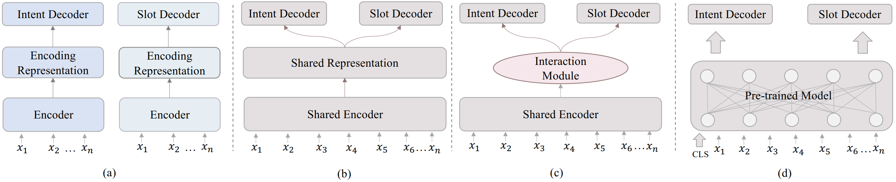
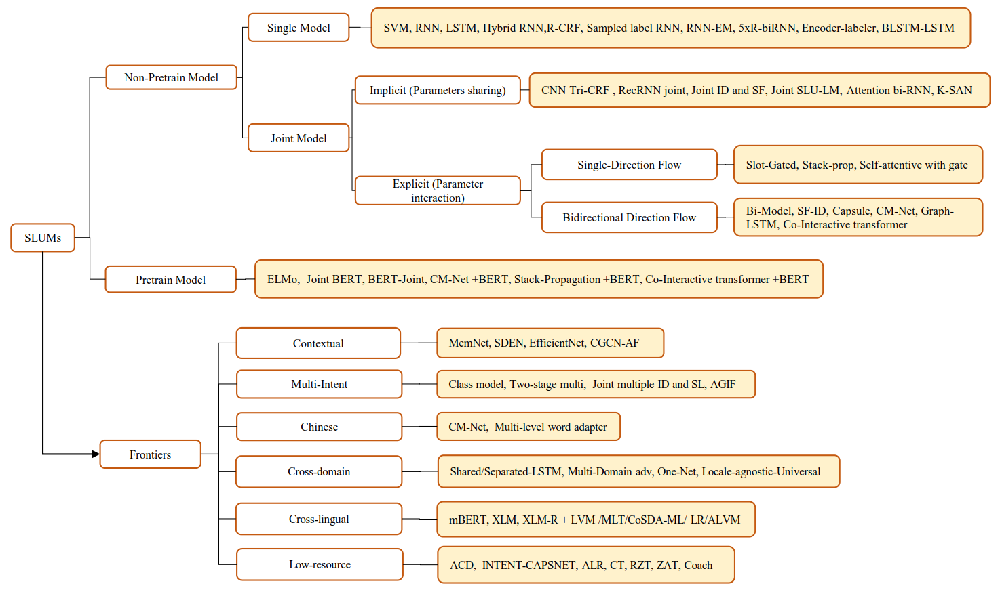

# A Survey on Spoken Language Understanding: Recent Advances and New Frontiers

  

# 🔥 Tutorial
### SLU tutorial (Spoken Language Understanding: Recent Advances and New Frontiers) at IJCAI2022. The Lecture for tutorial is available at [https://slututorial.github.io/](https://slututorial.github.io/).

# 🛠️ Toolkit

### SLU Toolkit (OpenSLU: A Unified, Modularized, and Extensible Toolkit for Spoken Language Understanding) at ACL2023(Demo). The code for toolkit is available at [https://github.com/LightChen233/OpenSLU](https://github.com/LightChen233/OpenSLU).

# Resource
This repository contains a list of papers, codes, datasets, leaderboards in SLU field. If you found any error, please don't hesitate to open an issue or pull request.

If you find this repository helpful for your work,  please kindly cite the following paper. The Bibtex are listed below:
<pre>
@misc{qin2021survey,
      title={A Survey on Spoken Language Understanding: Recent Advances and New Frontiers}, 
      author={Libo Qin and Tianbao Xie and Wanxiang Che and Ting Liu},
      year={2021},
      eprint={2103.03095},
      archivePrefix={arXiv},
      primaryClass={cs.CL}
}
</pre>

## Contributor

Tutorial Presented by [Libo Qin](http://ir.hit.edu.cn/~lbqin/), [Wanxiang Che](http://ir.hit.edu.cn/~car/),[Zhou Yu](http://www.cs.columbia.edu/~zhouyu/).

Resource Contributed by [Libo Qin](http://ir.hit.edu.cn/~lbqin/), [Tianbao Xie](https://github.com/Timothyxxx), [Yudi Zhang](https://github.com/zyd-project),  [Lehan Wang](https://github.com/luxuriant0116), [Wanxiang Che](http://ir.hit.edu.cn/~car/),[Zhou Yu](http://www.cs.columbia.edu/~zhouyu/).

## Introduction

Spoken language understanding (SLU) is a critical component in task-oriented dialogue systems. It usually consists of intent and slot filling task to extract semantic constituents from the natrual language utterances.

For the purpose of alleviating pressure in article/dataset collation, we worked on sorting out the relevant data sets, papers, codes and lists of SLU in this project.

At present, the project has been completely open source, including:
1. **SLU domain dataset sorting table:** we sorted out the dataset used in SLU field. You can index in it and get the message of general scale, basic structure, content, characteristics, source and acquisition method of the dataset you want to know.
2. **Articles and infos in different directions in the field of SLU:** we classified and arranged the papers according to the current mainstream frontiers. Each line of the list contains not only the title of the paper, but also the year of publication, the source of publication, the paper link and code link for quick indexing, as well as the dataset used.
3. **Leaderboard list on the mainstream datasets of SLU:** we sorted out the leaderboard on the mainstream datasets, and distinguished them according to pre-trained or not. In addition to the paper/model/method name and related scores, each line also has links to year, paper and code if it has.

The taxonomy and frontiers of our survey can be summarized into this picture below.

## Quick path
- [A Survey on Spoken Language Understanding: Recent Advances and New Frontiers](#a-survey-on-spoken-language-understanding-recent-advances-and-new-frontiers)
- [🔥 Tutorial](#-tutorial)
		- [SLU tutorial (Spoken Language Understanding: Recent Advances and New Frontiers) at IJCAI2022. The Lecture for tutorial is available at https://slututorial.github.io/.](#slu-tutorial-spoken-language-understanding-recent-advances-and-new-frontiers-at-ijcai2022-the-lecture-for-tutorial-is-available-at-httpsslututorialgithubio)
- [Resource](#resource)
	- [Contributor](#contributor)
	- [Introduction](#introduction)
	- [Quick path](#quick-path)
	- [Resources](#resources)
		- [survey paper links](#survey-paper-links)
		- [recent open-sourced code](#recent-open-sourced-code)
		- [Single Model](#single-model)
		- [Joint Model](#joint-model)
		- [Complex SLU Model](#complex-slu-model)
	- [Dataset](#dataset)
	- [Frontiers](#frontiers)
		- [Single Slot Filling](#single-slot-filling)
		- [Single Intent Detection](#single-intent-detection)
		- [Joint Model](#joint-model-1)
			- [Implicit joint modeling](#implicit-joint-modeling)
			- [Explicit joint modeling](#explicit-joint-modeling)
		- [Contextual SLU](#contextual-slu)
		- [Multi-intent SLU](#multi-intent-slu)
		- [Chinese SLU](#chinese-slu)
		- [Robust SLU](#robust-slu)
		- [Cross-domain SLU](#cross-domain-slu)
		- [Cross-lingual SLU](#cross-lingual-slu)
		- [Low-resource SLU](#low-resource-slu)
			- [Few-shot SLU](#few-shot-slu)
			- [Zero-shot SLU](#zero-shot-slu)
			- [Unsupervised SLU](#unsupervised-slu)
	- [LeaderBoard](#leaderboard)
		- [ATIS](#atis)
			- [Non-pretrained model](#non-pretrained-model)
			- [+ Pretrained model](#-pretrained-model)
		- [SNIPS](#snips)
			- [Non-pretrained model](#non-pretrained-model-1)
			- [+ Pretrained model](#-pretrained-model-1)

## Resources
### survey paper links

1. **A Survey on Spoken Language Understanding: Recent Advances and New Frontiers** `arxiv` [[pdf]](https://arxiv.org/pdf/2103.03095.pdf)
2. **Spoken language understanding: Systems for extracting semantic information from speech** `book` [[pdf]](https://ieeexplore.ieee.org/book/8042134)
3. **Recent Neural Methods on Slot Filling and Intent Classification**  `COLING 2020` [[pdf]](https://www.aclweb.org/anthology/2020.coling-main.42.pdf) 
4. **A survey of joint intent detection and slot-filling models in natural language understanding**  `arxiv 2021` [[pdf]](https://arxiv.org/pdf/2101.08091.pdf) 

### recent open-sourced code

### Single Model

1. **Few-shot Slot Tagging with  Collapsed Dependency Transfer and Label-enhanced Task-adaptive Projection  Network** (SNIPS) `ACL 2020` [[pdf]](https://www.aclweb.org/anthology/2020.acl-main.128.pdf) [[code]](https://github.com/AtmaHou/FewShotTagging) 
2. **Sequence-to-Sequence Data  Augmentation for Dialogue Language Understanding** (ATIS/Stanford Dialogue Dataset) `COLING 2018` [[pdf]](https://arxiv.org/pdf/1807.01554.pdf) [[code]](https://github.com/AtmaHou/Seq2SeqDataAugmentationForLU) 

### Joint Model

1. **A Co-Interactive Transformer for Joint Slot Filling and Intent Detection**(ATIS/SNIPS) `ICASSP 2021` [[pdf]](https://arxiv.org/pdf/2010.03880.pdf) [[code]](https://github.com/kangbrilliant/DCA-Net)
2. **SlotRefine: A Fast Non-Autoregressive Model for Joint Intent Detection and Slot Filling** (ATIS/SNIPS) `EMNLP 2020` [[pdf]](https://www.aclweb.org/anthology/2020.emnlp-main.152.pdf) [[code]](https://github.com/moore3930/SlotRefine)
3. **Joint Slot Filling and Intent  Detection via Capsule Neural Networks** (ATIS/SNIPS) `ACL 2019` [[pdf]](https://arxiv.org/pdf/1812.09471.pdf) [[code]](https://github.com/czhang99/Capsule-NLU) 
4. **BERT for Joint Intent  Classification and Slot Filling** (ATIS/SNIPS/Stanford Dialogue Dataset) `arXiv 2019` [[pdf]](https://arxiv.org/pdf/1902.10909.pdf) [[code]](https://github.com/monologg/JointBERT) 
5. **A Novel Bi-directional  Interrelated Model for Joint Intent Detection and Slot Filling** (ATIS/Stanford Dialogue Dataset/SNIPS) `ACL 2019` [[pdf]](https://www.aclweb.org/anthology/P19-1544.pdf) [[code]](https://github.com/ZephyrChenzf/SF-ID-Network-For-NLU) 
6. **CM-Net: A Novel Collaborative Memory Network for Spoken Language Understanding** (ATIS/SNIPS/CAIS) `EMNLP 2019` [[pdf]](https://www.aclweb.org/anthology/D19-1097.pdf) [[code]](https://github.com/Adaxry/CM-Net) 
7. **Slot-Gated Modeling for Joint  Slot Filling and Intent Prediction** (ATIS/Stanford Dialogue Dataset,SNIPS) `NAACL 2018` [[pdf]](https://www.aclweb.org/anthology/N18-2118.pdf) [[code]](https://github.com/MiuLab/SlotGated-SLU) 
8. **Joint Online Spoken Language  Understanding and Language Modeling with Recurrent Neural Networks** (ATIS) `SIGDIAL 2016` [[pdf]](https://www.aclweb.org/anthology/W16-3603.pdf) [[code]](https://github.com/HadoopIt/joint-slu-lm)

### Complex SLU Model

1. **How Time Matters: Learning Time-Decay Attention for Contextual Spoken Language Understanding in Dialogues** (DSTC4) `NAACL 2018` [[pdf]](https://www.aclweb.org/anthology/N18-1194.pdf) [[code]](https://github.com/MiuLab/Time-Decay-SLU) 
2. **Speaker Role Contextual Modeling for Language Understanding and Dialogue Policy Learning** (DSTC4) `IJCNLP 2017` [[pdf]](https://www.aclweb.org/anthology/I17-2028.pdf) [[code]](https://github.com/MiuLab/Spk-Dialogue) 
3. **Dynamic time-aware attention to speaker roles and contexts for spoken language understanding** (DSTC4) `IEEE 2017` [[pdf]](https://arxiv.org/pdf/1710.00165.pdf) [[code]](https://github.com/MiuLab/Time-SLU) 
4. **Injecting Word Information with Multi-Level Word Adapter for Chinese Spoken Language Understanding** (CAIS/ECDT-NLU) `arXiv 2020` [[pdf]](https://arxiv.org/pdf/2010.03903.pdf) [[code]](https://github.com/AaronTengDeChuan/MLWA-Chinese-SLU) 
5. **CM-Net: A Novel Collaborative Memory Network for Spoken Language Understanding** (ATIS/SNIPS/CAIS) `EMNLP 2019` [[pdf]](https://www.aclweb.org/anthology/D19-1097.pdf) [[code]](https://github.com/Adaxry/CM-Net) 
6. **Coach: A Coarse-to-Fine  Approach for Cross-domain Slot Filling** (SNIPS) `ACL 2020` [[pdf]](https://arxiv.org/pdf/2004.11727.pdf) [[code]](https://github.com/zliucr/coach)
7. **CoSDA-ML: Multi-Lingual  Code-Switching Data Augmentation for Zero-Shot Cross-Lingual NLP** (SC2/4/MLDoc/Multi WOZ/Facebook Multilingual SLU Dataset) `IJCAI 2020` [[pdf]](https://arxiv.org/pdf/2006.06402.pdf) [[code]](https://github.com/kodenii/CoSDA-ML) 
8. **Cross-lingual Spoken Language  Understanding with Regularized Representation Alignment** (Multilingual spoken language understanding (SLU) dataset) `EMNLP 2020` [[pdf]](https://arxiv.org/pdf/2009.14510.pdf) [[code]](https://github.com/zliucr/crosslingual-slu.)
9. **Attention-Informed  Mixed-Language Training for Zero-shot Cross-lingual Task-oriented Dialogue  Systems** (Facebook Multilingual SLU Dataset/(DST)MultiWOZ) `AAAI 2020` [[pdf]](https://arxiv.org/pdf/1911.09273.pdf) [[code]](https://github.com/zliucr/mixedlanguage-training) 
10. **MTOP: A Comprehensive Multilingual Task-Oriented Semantic Parsing Benchmark** (MTOP/Multilingual ATIS) `arXiv 2020` [[pdf]](https://arxiv.org/pdf/2008.09335.pdf) [[code]]() 
11. **Neural Architectures for  Multilingual Semantic Parsing** (GEO/ATIS) `ACL 2017` [[pdf]](https://www.aclweb.org/anthology/P17-2007.pdf) [[code]](http://statnlp.org/research/sp/) 
12. **Few-shot Learning for Multi-label Intent Detection** (TourSG/StandfordLU) `AAAI 2021` [[pdf]](https://arxiv.org/abs/2010.05256.pdf) [[code]](https://github.com/AtmaHou/FewShotMultiLabel) 
13. **Few-shot Slot Tagging with Collapsed Dependency Transfer and Label-enhanced Task-adaptive Projection Network** (SNIPS and further construct) `ACL 2020` [[pdf]](https://www.aclweb.org/anthology/2020.acl-main.128.pdf) [[code]](https://github.com/AtmaHou/FewShotTagging)
14. **Text Is No More Enough! A Benchmark for Profile-Based Spoken Language Understanding** (Profile SLU) `AAAI 2022` [[pdf]](https://ojs.aaai.org/index.php/AAAI/article/view/21411) [[code]](https://github.com/LooperXX/ProSLU)

## Dataset

<table style="width:100%" border="2">
<thead>
  <tr>
    <th>Name</th>
    <th>Intro</th>
    <th>Links</th>
    <th>Multi/Single Turn(M/S)</th>
    <th>Detail</th>
    <th>Size & Stats</th>
    <th>Label</th>
  </tr>
</thead>
<tbody >
<tr>
	<td><code> ATIS                               </td></code>
		<td> 1. The ATIS (Airline Travel Information Systems) dataset (Tur  et al., 2010) is widely used in SLU research 2. For natural language  understanding </td>
		<td> Download:         1.https://github.com/yizhen20133868/StackPropagation-SLU/tree/master/data/atis         2.https://github.com/yvchen/JointSLU/tree/master/data      Paper:      https://www.aclweb.org/anthology/H90-1021.pdf </td>
		<td> S                       </td>
		<td> Airline Travel Information     However, this data set has been shown to have a serious skew problem on intent </td>
		<td> Train: 4478 Test: 893 120 slot and 21 intent                 </td>
		<td> Intent Slots                                                 </td></tr>
<tr>
	<td><code> SNIPS                              </td></code>
		<td> 1. Collected by Snips for model evaluation. 2. For natural   language understanding 3. Homepage:   https://medium.com/snips-ai/benchmarking-natural-language-understanding-systems-google-facebook-microsoft-and-snips-2b8ddcf9fb19 </td>
		<td> Download:       https://github.com/snipsco/nlu-benchmark/tree/master/2017-06-custom-intent-engines      Paper:      https://arxiv.org/pdf/1805.10190.pdf </td>
		<td> S                       </td>
		<td> 7 task: Weather,play music, search, add to list, book, moive </td>
		<td> Train:13,084 Test:700 7 intent 72 slot labels                </td>
		<td> Intent Slots                                                 </td></tr>
<tr>
	<td><code> Facebook Multilingual SLU  Dataset </td></code>
		<td> 1 Contains English, Spanish, and Thai across the weather,  reminder, and alarm domains      2 For cross-lingual SLU </td>
		<td> Download:      https://fb.me/multilingual_task_oriented_data      Paper:      https://www.aclweb.org/anthology/N19-1380.pdf </td>
		<td> S                       </td>
		<td> Utterances are manually translated and annotated             </td>
		<td> Train: English 30,521; Spanish 3,617; Thai 2,156     Dev: English 4,181; Spanish 1,983; Thai 1,235     Test: English 8,621; Spanish 3,043; Thai 1,692     11 slot and 12 intent </td>
		<td> Intent Slots                                                 </td></tr>
<tr>
	<td><code> MIT Restraunt Corpus               </td></code>
		<td> MIT corpus contains train set and test set in BIO format for  NLU </td>
		<td> Download:      https://groups.csail.mit.edu/sls/downloads/restaurant/ </td>
		<td> S                       </td>
		<td> It is a single-domain dataset, which is associated with  restaurant reservations. MR contains ‘open-vocabulary’ slots, such as  restaurant names </td>
		<td> Train:7760      Test:1521                                    </td>
		<td> Slots                                                        </td>

</tr>
<tr>
	<td><code> MIT Movie Corpus                   </td></code>
		<td> The MIT Movie Corpus is a semantically tagged training and  test corpus in BIO format.      The eng corpus are simple queries, and the trivia10k13 corpus are more  complex queries. </td>
		<td> Download:      https://groups.csail.mit.edu/sls/downloads/movie/ </td>
		<td> S                       </td>
		<td> The MIT movie corpus consists of two single-domain datasets:  the movie eng (ME) and movie trivia (MT) datasets. While both datasets  contain queries about film information, the trivia queries are more complex  and specific </td>
		<td> eng Corpus:     Train:9775     Test:2443     Trivia Corpus:     Train:7816     Test:1953 </td>
		<td> Slots                                                        </td>
		
</tr>
<tr>
	<td><code> Multilingual ATIS                  </td></code>
		<td> ATIS was manually translated into Hindi and Turkish          </td>
		<td> Download:      It has been put into LDC, and you can download it if you are own a   membership or pay for it      Paper:      http://shyamupa.com/papers/UFTHH18.pdf </td>
		<td> S                       </td>
		<td> 3 languages                                                  </td>
		<td> On the top of ATIS dataset, 893 and 715 utterances from the  ATIS test split were translated     and annotated for Hindi and Turkish evaluation respectively     also translated and annotated 600(each language     separately) utterances from the ATIS train split to use as  supervision     In total 37,084 training examples  and 7,859 test examples </td>
		<td> Intent Slots                                                 </td>
		
</tr>
<tr>
	<td><code> Multilingual ATIS++                </td></code>
		<td> Extends Multilingual ATIS corpus to     nine languages across four language families </td>
		<td> Download:      contact multiatis@amazon.com.      Paper:      https://arxiv.org/abs/2004.14353 </td>
		<td> S                       </td>
		<td> 10 languages                                                 </td>
		<td> check the paper to find the full table of description     (to many info ,have no enough space here) </td>
		<td> Intent Slots                                                 </td>
		
</tr>
<tr>
	<td><code> Almawave-SLU                       </td></code>
		<td> 1. A dataset for Italian SLU     2. Was generated through a semi-automatic procedure from SNIPS </td>
		<td> Download:      contact [first name initial\].[last name]@almawave.it for the dataset      (any author in this paper)      Paper:      https://arxiv.org/pdf/1907.07526.pdf </td>
		<td> S                       </td>
		<td> 6 domains: Music, Restaurants, TV, Movies,     Books, Weather </td>
		<td> Train: 7,142     Validation: 700     Test: 700     7 intents and 39 slots </td>
		<td> Intent Slots                                                 </td>
		
</tr>
<tr>
	<td><code> Chatbot Corpus                     </td></code>
		<td> 1. Chatbot Corpus is based on questions gathered by a Telegram  chatbot which answers questions about public transport connections,  consisting of 206 questions     2. For intent classification test </td>
		<td> Download:      https://github.com/sebischair/NLU-Evaluation-Corpora      Paper:      https://www.aclweb.org/anthology/W17-5522.pdf </td>
		<td> S                       </td>
		<td> 2 Intents: Departure Time, Find Connection     5 entity types: StationStart, StationDest, Criterion, Vehicle, Line </td>
		<td> Train: 100     Test: 106                                     </td>
		<td> Intent Entity                                                </td>
		
</tr>
<tr>
	<td><code> StackExchange Corpus               </td></code>
		<td> 1. StackExchange Corpus is based on data from two  StackExchange platforms: ask ubuntu and Web Applications     2. Gathers 290 questions and answers in total, 100 from Web Applications  and 190 from ask ubuntu     3. For intent classification test </td>
		<td> Download:         https://github.com/sebischair/NLU-Evaluation-Corpora       Paper:      https://www.aclweb.org/anthology/W17-5522.pdf </td>
		<td> S                       </td>
		<td> Ask ubuntu Intents: “Make Update”, “Setup Printer”, “Shutdown  Computer”, and “Software Recommendation”     Web Applications Intents: “Change  Password”, “Delete Account”, “Download Video”, “Export Data”, “Filter Spam”,  “Find Alternative”, and “Sync Accounts” </td>
		<td> Total: 290     Ask ubuntu: 190     Web Application: 100      </td>
		<td> Intent Entity                                                </td>
		
</tr>
<tr>
	<td><code> MixSNIPS/MixATIS                   </td></code>
		<td> multi-intent dataset based on SNIPS and ATIS                 </td>
		<td> Download:      https://github.com/LooperXX/AGIF/tree/master/data      Paper:      https://www.aclweb.org/anthology/2020.findings-emnlp.163.pdf </td>
		<td> S                       </td>
		<td> using conjunctions, connecting sentences with different  intents forming a ratio of 0.3,0.5 and 0.2 for sentences has which 1,2 and 3  intents, respectively </td>
		<td> Train:12,759 utterances     Dev:4,812 utterances     Test:7,848 utterances </td>
		<td> Intent(Multi),Slots                                          </td>
		
</tr>
<tr>
	<td><code> TOP semantic parsing               </td></code>
		<td> 1,Hierarchical annotation scheme for semantic parsing     2,Allows the representation of compositional queries     3,Can be efficiently and accurately parsed by standard constituency parsing  models </td>
		<td> Download:      http://fb.me/semanticparsingdialog      Paper:      https://www.aclweb.org/anthology/D18-1300.pdf </td>
		<td> S                       </td>
		<td> focused on navigation, events, and navigation to events     evaluation script can be run from evaluate.py within the dataset </td>
		<td> 44783 annotations     Train:31279     Dev:4462     Test:9042 </td>
		<td> Inten ,Slots in Tree  format                                 </td>
		
</tr>
<tr>
	<td><code> MTOP: Multilingual TOP             </td></code>
		<td> 1.An almost-parallel multilingual task-oriented semantic  parsing dataset covering 6 languages and 11 domains.     2.the first multilingual dataset that contain compositional representations  that allow complex nested queries.     3.the dataset creation: i) generating synthetic utterances and annotating  in English, ii) translation, label transfer, post-processing, post editing  and filtering for other languages </td>
		<td> Download:      https://fb.me/mtop_dataset      Paper:      https://arxiv.org/pdf/2008.09335.pdf </td>
		<td> S                       </td>
		<td> 6 languages (both high  and low resource): English, Spanish, French, German, Hindi and Thai.       a mix of both simple as well as  compositional nested queries across 11 domains, 117 intents and 78 slots. </td>
		<td> 100k examples in total for 6 languages.     Roughly divided into 70:10:20 percent splits for train,eval and test. </td>
		<td> Two kinds of  representations:     1.flat representatiom: Intent and slots     2.compositional decoupled representations:nested intents inside slots     More details 3.2 section in the paper </td>
		
</tr>
<tr>
	<td><code> CAIS                               </td></code>
		<td> Collected from real world speaker systems  with manual annotations of slot tags and intent labels </td>
		<td> [https://github.com/Adaxry/CM-Net](https://github.com/Adaxry/CM-Net/tree/master/CAIS) </td>
		<td> S                       </td>
		<td> 1.The utterances were collected from the Chinese Artificial Intelligence Speakers 2.Adopt the BIOES tagging scheme for slots instead of the BIO2 used in the ATIS 3.intent labels are partial to the PlayMusic option </td>
		<td> Train: 7,995 utterances Dev: 994 utterances Test: 1024 utterances </td>
		<td> slots tags and intent labels                                 </td>
		
</tr>
<tr>
	<td><code> Simulated Dialogues dataset        </td></code>
		<td> machines2machines (M2M)                                      </td>
		<td> Download: https://github.com/google-research-datasets/simulated-dialogue Paper: http://www.colips.org/workshop/dstc4/papers/60.pdf </td>
		<td> M                       </td>
		<td> Slots: Sim-R (Restaurant)        price_range, location, restaurant_name, category, num_people, date, time Sim-M (Movie)        theatre_name, movie, date, time, num_people Sim-GEN (Movie):theatre_name, movie, date, time, num_people </td>
		<td> Train: Sim-R:1116 Sim-M:384 Sim-GEN:100k Dev: Sim-R:349 Sim-M:120 Sim-GEN:10k Test: Sim-R:775 Sim-M:264 Sim-GEN:10k </td>
		<td> Dialogue state User's act,slot,intent System's act,slot      </td>
		
</tr>
<tr>
	<td><code> Schema-Guided Dialogue Dataset(SGD) </td></code>
		<td> dialogue simulation(auto based on identified scenarios), word-replacement and human intergration as paraphrasing</td>
		<td> Download:  https://github.com/google-researchdatasets/dstc8-schema-guided-dialogue Paper: https://arxiv.org/pdf/1909.05855.pdf </td>
		<td> M                       </td>
		<td> domains:16,dialogues:16142,turns:329964,acg turns per dialogue:20.44,total unique tokens:30352,slots:214,slot values:14319</td>
		<td> NA </td>
		<td>   Scheme Representation: service_name;description;slot's name,description,is_categorial,possible_values;intent's name,description,is_transactional,required_slots,optional_slots,result_slots. Dialogue Representation: dialogue_id,services,turns,speaker,utterance,frame,service,slot's name,start,exclusive_end;action's act,slot,values,canonical_values;service_call's method,parameters;service_results,state's active_intent,requested_slots,slot_values </td>
		
</tr>
<tr>
    <td><code> CLINC150 </td></code>
		<td> A intent classification (text classification) dataset with 150 in-domain intent classes. The main purpose of this dataset is to evaluate various classifiers on out-of-domain performance. </td>
		<td> Download: https://archive.ics.uci.edu/ml/datasets/CLINC150 Paper: https://www.aclweb.org/anthology/D19-1131/ </td>
		<td> S </td>
		<td> data_full.json: 150 in-domain intent classes 100 train, 20 val, and 30 test samples while out-of-domain 100 train, 100 val, and 1,000 test samples, data_small.json: in-domain 50 train, 20 val, and 30 test, out-domain 100 train, 100 val, and 1,000 test samples.  data_imbalanced.json: in-domain intent classes 25, 50, 75, or 100 train, 20 val, and 30 samples while out-of-domain class has 100 train, 100 val, and 1,000 test samples.  data_oos_plus.json:  same as data_full.json except there are 250 out-of-domain training samples.</td>
		<td> size 23700 intent 150 </td>
		<td> Intent(in-domain, out-domain) </td>
</tr>
<tr>
    <td><code> HWU64 </td></code>
		<td>  </td>
		<td> Download: https://github.com/xliuhw/NLU-Evaluation-Data Paper: https://arxiv.org/pdf/1903.05566.pdf  </td>
		<td> S </td>
		<td> 21 domains,inter alia,music, news,calendar  </td>
		<td> size 25716, intents 64, slots 54</td>
		<td> Intent detection;Entity extraction </td>
</tr>
<tr>
    <td><code> Banking-77 </td></code>
		<td> BANKING77 dataset provides a very fine-grained set of intents in a banking domain. It comprises 13,083 customer service queries labeled with 77 intents. It focuses on fine-grained single-domain intent detection. </td>
		<td> Download: github.com/PolyAI-LDN/polyai-models Paper: https://arxiv.org/pdf/2003.04807.pdf </td>
		<td> S </td>
		<td> banking </td>
		<td> size 13083 intents 77 </td>
		<td> Intent detection </td>
</tr>
<tr>
    <td><code> Restaurants-8K </td></code>
		<td>  A new challenging data set of 8,198 utterances, compiled from actual conversations in the restaurant booking domain.</td>
		<td> Download: https://github.com/PolyAI-LDN/task-specific-datasets Paper: https://arxiv.org/pdf/2005.08866.pdf </td>
		<td> S </td>
		<td> restaurant booking </td>
		<td> size 11929 slots 5 </td>
		<td> Slot filling </td>
</tr>
<tr>
    <td><code> ATIS in Chinese and Indonesian </td></code>
		<td> ATIS semantic dataset annotated in two new languages </td>
		<td> Download: http://statnlp.org/research/sp/ Paper: https://www.aclweb.org/anthology/P17-2007.pdf </td>
		<td> S </td>
		<td> airline travels </td>
		<td> size 5371 slot 120(166;lambda-calculus) </td>
		<td> Semantic parsing; Slot filling </td>
</tr>
<tr>
    <td><code> Vietnamese ATIS </td></code>
		<td>  </td>
		<td> Download : https://github.com/VinAIResearch/JointIDSF Paper : https://arxiv.org/pdf/2104.02021.pdf </td>
		<td> S </td>
		<td> airline travels </td>
		<td> size 5871 intent 25 slot 120 </td>
		<td> Intent detection, Slot filling. </td></tr>
<tr>
    <td><code> xSID </td></code>
		<td> Translation of part of facebook and snips dataset</td>
		<td> Download : https://bitbucket.org/robvanderg/xsid Paper : https://aclanthology.org/2021.naacl-main.197.pdf </td>
		<td> S </td>
		<td> Languages: Arabic, Danish, South-Tyrolean, German, English, Indonesian, Italian, Japanese, Kazakh, Dutch, Serbian, Turkish, Chinese. Intents: AddToPlaylist, BookRestaurant, PlayMusic, RateBook, SearchCreativeWork, SearchScreeningEvent, alarm/cancel_alarm, alarm/modify_alarm, alarm/set_alarm, alarm/show_alarms, alarm/snooze_alarm, reminder/cancel_reminder, reminder/set_reminder, reminder/show_reminders, weather/find.</td>
		<td> 500 test, 300 dev for each language. 43605 English train (automatic translation into all languages also provided)</td>
		<td> Intent detection, Slot filling. </td></tr>
		<tr>
    <td><code> ProSLU </td></code>
		<td> Profile-based Spoken Language Understanding (Profile SLU) requires the model that not only relies on the plain text but also the supporting profile information to predict the correct intents and slots.  </td>
		<td> Download : https://github.com/LooperXX/ProSLU/tree/master/data/ProSLU 
		Paper : https://ojs.aaai.org/index.php/AAAI/article/view/21411 </td>
		<td> S </td>
		<td> A large-scale human-annotated Chinese dataset with over 5K utterances and their corresponding supporting profile information: Knowledge Graph (KG), User Profile (UP), Context Awareness (CA). Experiments on various vanilla SLU baselines, and a general Profile SLU model with the multi-level knowledge adapter are provided. </td> 
		<td> Train: 4196, Dev: 522, Test: 531; intent 14, slot 99. </td>
		<td> Intent detection, Slot filling. </td></tr>

</tbody >
</table>

## Frontiers

### Single Slot Filling

1. **Few-shot Slot Tagging with  Collapsed Dependency Transfer and Label-enhanced Task-adaptive Projection  Network** (SNIPS) `ACL 2020` [[pdf]](https://www.aclweb.org/anthology/2020.acl-main.128.pdf) [[code]](https://github.com/AtmaHou/FewShotTagging) 
2. **A Hierarchical Decoding Model  For Spoken Language Understanding From Unaligned Data** (DSTC2) `ICASSP 2019` [[pdf]](https://arxiv.org/pdf/1904.04498.pdf) 
3. **Utterance Generation With  Variational Auto-Encoder for Slot Filling in Spoken Language Understanding** (ATIS/SNIPS/MIT Corpus) `IEEE Signal Processing Letters 2019` [[pdf]]([https://ieeexplore.ieee.org/document/8625384](https://ieeexplore.ieee.org/stamp/stamp.jsp?tp=&arnumber=8625384)) 
4. **Data Augmentation with Atomic  Templates for Spoken Language Understanding** (ATIS) `EMNLP 2019` [[pdf]](https://arxiv.org/pdf/1908.10770.pdf) 
5. **A New Concept of Deep  Reinforcement Learning based Augmented General Sequence Tagging System** (ATIS/CNLL-2003) `COLING 2018` [[pdf]](https://www.aclweb.org/anthology/C18-1143.pdf) 
6. **Improving Slot Filling in  Spoken Language Understanding with Joint Pointer and Attention** (DSTC2) `ACL 2018` [[pdf]](https://www.aclweb.org/anthology/P18-2068.pdf) 
7. **Sequence-to-Sequence Data  Augmentation for Dialogue Language Understanding** (ATIS/Stanford Dialogue Dataset) `COLING 2018` [[pdf]](https://arxiv.org/pdf/1807.01554.pdf) [[code]](https://github.com/AtmaHou/Seq2SeqDataAugmentationForLU) 
8. **Encoder-Decoder with  Focus-Mechanism for Sequence Labelling Based Spoken Language Understanding** (ATIS) `ICASSP 2017` [[pdf]]([https://ieeexplore.ieee.org/stamp/stamp.jsp?tp=&arnumber=79532433](https://ieeexplore.ieee.org/stamp/stamp.jsp?tp=&arnumber=7953243)) 
9. **Neural Models for Sequence  Chunking** (ATIS/LARGE) `AAAI 2017` [[pdf]](https://arxiv.org/pdf/1701.04027.pdf) 
10. **Bi-directional recurrent  neural network with ranking loss for spoken language understanding** (ATIS) `IEEE 2016` [[pdf]](https://ieeexplore.ieee.org/abstract/document/7472841/) 
11. **Labeled Data Generation with  Encoder-decoder LSTM for Semantic Slot Filling** (ATIS) `INTERSPEECH 2016` [[pdf]](https://pdfs.semanticscholar.org/7ffe/83d7dd3a474e15ccc2aef412009f100a5802.pdf) 
12. **Syntax or Semantics?  Knowledge-Guided Joint Semantic Frame Parsing** (ATIS/Cortana) `IEEE Workshop on Spoken Language Technology 2016` [[pdf]](https://www.csie.ntu.edu.tw/~yvchen/doc/SLT16_SyntaxSemantics.pdf) 
13. **Bi-Directional Recurrent  Neural Network with Ranking Loss for Spoken Language Understanding** (ATIS) `ICASSP 2016` [[pdf]](https://ieeexplore.ieee.org/stamp/stamp.jsp?tp=&arnumber=7472841) 
14. **Leveraging Sentence-level  Information with Encoder LSTM for Semantic Slot Filling** (ATIS) `EMNLP 2016` [[pdf]](https://www.aclweb.org/anthology/D16-1223.pdf) 
15. **Labeled Data Generation with  Encoder-decoder LSTM for Semantic Slot Filling** (ATIS) `INTERSPEECH 2016` [[pdf]](https://www.isca-speech.org/archive/Interspeech_2016/pdfs/0727.PDF) 
16. **Using Recurrent Neural  Networks for Slot Filling in Spoken Language Understanding** (ATIS) `IEEE/ACM TASLP 2015` [[pdf]](https://ieeexplore.ieee.org/document/6998838) 
17. **Using Recurrent Neural  Networks for Slot Filling in Spoken Language Understanding** (ATIS) `IEEE/ACM Transactions on Audio, Speech, and Language  Processing 2015` [[pdf]](https://ieeexplore.ieee.org/stamp/stamp.jsp?tp=&arnumber=6998838) 
18. **Recurrent  Neural Network Structured Output Prediction for Spoken Language Understanding** (ATIS) `- 2015` [[pdf]](http://speech.sv.cmu.edu/publications/liu-nipsslu-2015.pdf) 
19. **Spoken Language Understanding  Using Long Short-Term Memory Neural Networks** (ATIS) `IEEE 2014` [[pdf]](https://groups.csail.mit.edu/sls/publications/2014/Zhang_SLT_2014.pdf) 
20. **Recurrent conditional random  field for language understanding** (ATIS) `IEEE 2014` [[pdf]](https://ieeexplore.ieee.org/document/6854368) 
21. **Recurrent Neural Networks for  Language Understanding** (ATIS) `INTERSPEECH 2013` [[pdf]](https://www.microsoft.com/en-us/research/wp-content/uploads/2016/02/kaisheny-338_file_paper.pdf) 
22. **Investigation of  Recurrent-Neural-Network Architectures and Learning Methods for Spoken  Language Understanding** (ATIS) `ISCA 2013` [[pdf]](https://www.isca-speech.org/archive/archive_papers/interspeech_2013/i13_3771.pdf) 
23. **Large-scale personal assistant  technology deployment: the siri experience** (-) `INTERSPEECH 2013` [[pdf]](https://isca-speech.org/archive/archive_papers/interspeech_2013/i13_2029.pdf) 

### Single Intent Detection

1. **Zero-shot User Intent  Detection via Capsule Neural Networks** (SNIPS/CVA) `EMNLP 2018` [[pdf]](https://arxiv.org/pdf/1809.00385.pdf) 
2. **Intention Detection Based on Siamese Neural Network With Triplet Loss** (SNIPS/ATIS/Facebook multilingual datasets/ Daily Dialogue/MRDA) `IEEE Acess 2020` [[pdf]](https://ieeexplore.ieee.org/document/9082602) 
3. **Multi-Layer Ensembling Techniques for Multilingual Intent Classification** (ATIS) `arXiv 2018` [[pdf]](https://arxiv.org/pdf/1806.07914.pdf) 
4. **Deep Unknown Intent Detection with Margin Loss** (SNIPS/ATIS) `ACL 2019` [[pdf]](https://arxiv.org/pdf/1906.00434.pdf) 
5. **Subword Semantic Hashing for Intent Classification on Small Datasets** (The Chatbot Corpus/The AskUbuntu Corpus) `IJCNN 2019` [[pdf]](https://arxiv.org/pdf/1810.07150.pdf) 
6. **Dialogue intent classification with character-CNN-BGRU networks** (the Chinese Wikipedia dataset) `Multimedia Tools and Applications 2018` [[pdf]](https://link.springer.com/article/10.1007/s11042-019-7678-1)  
7. **Joint Learning of Domain Classification and Out-of-Domain Detection with Dynamic Class Weighting for Satisficing False Acceptance Rates** (Alexa) `InterSpeech 2018` [[pdf]](https://www.isca-speech.org/archive/Interspeech_2018/pdfs/1581.pdf)  
8. **Recurrent neural network and  LSTM models for lexical utterance classification** (ATIS/CB) `INTERSPEECH 2015` [[pdf]](https://www.microsoft.com/en-us/research/wp-content/uploads/2016/02/RNNLM_addressee.pdf) 
9. **Adversarial Training for Multi-task and Multi-lingual Joint Modeling of Utterance Intent Classification** (collected by the author) `ACL 2018` [[pdf]](https://www.aclweb.org/anthology/D18-1064.pdf) 
10. **Exploiting Shared Information for Multi-Intent Natural Language Sentence Classification** (collected by the author) `ISCA 2013` [[pdf]](https://www.microsoft.com/en-us/research/wp-content/uploads/2013/08/double_intent.pdf)  

### Joint Model

#### Implicit joint modeling

1.  **Leveraging Non-Conversational  Tasks for Low Resource Slot Filling: Does it help?** (ATIS/MIT Restaurant, and Movie/OntoNotes 5.0/OPUS   News Commentary) `SIGDIAL 2019` [[pdf]](https://www.aclweb.org/anthology/W19-5911.pdf) 
2.  **Simple, Fast, Accurate Intent Classification and Slot Labeling for Goal-Oriented Dialogue Systems** (ATIS/SNIPS) `SIGDIAL 2019` [[pdf]](https://www.aclweb.org/anthology/W19-5906.pdf)
3.  **Multi-task learning for Joint  Language Understanding and Dialogue State Tracking** (M2M/DSTC2) `SIGDIAL 2018` [[pdf]](https://www.aclweb.org/anthology/W18-5045.pdf) 
4.  **A Joint Model of Intent  Determination and Slot Filling for Spoken Language Understanding** (ATIS/CQUD) `IJCAI 2016` [[pdf]](https://www.ijcai.org/Proceedings/16/Papers/425.pdf) 
5.  **Joint Online Spoken Language  Understanding and Language Modeling with Recurrent Neural Networks** (ATIS) `SIGDIAL 2016` [[pdf]](https://www.aclweb.org/anthology/W16-3603.pdf) [[code]](https://github.com/HadoopIt/joint-slu-lm)
6.  **Multi-Domain Joint Semantic  Frame Parsing using Bi-directional RNN-LSTM** (ATIS) `INTERSPEECH 2016` [[pdf]](https://pdfs.semanticscholar.org/d644/ae996755c803e067899bdd5ea52498d7091d.pdf) 
7.  **Attention-Based Recurrent  Neural Network Models for Joint Intent Detection and Slot Filling** (ATIS) `INTERSPEECH 2016` [[pdf]](https://arxiv.org/pdf/1609.01454.pdf) 
8.  **Multi-domain joint semantic  frame parsing using bi-directional RNN-LSTM** (ATIS) `INTERSPEECH 2016` [[pdf]](https://www.microsoft.com/en-us/research/wp-content/uploads/2016/06/IS16_MultiJoint.pdf) 
9.  **JOINT SEMANTIC UTTERANCE  CLASSIFICATION AND SLOT FILLING WITH RECURSIVE NEURAL NETWORKS** (ATIS/Stanford Dialogue Dataset,Microsoft Cortana  conversational understanding task(-)) `IEEE SLT 2014` [[pdf]](https://ieeexplore.ieee.org/stamp/stamp.jsp?tp=&arnumber=7078634) 
10.  **CONVOLUTIONAL NEURAL NETWORK  BASED TRIANGULAR CRF FOR JOINT INTENT DETECTION AND SLOT FILLING** (ATIS) `IEEE Workshop on Automatic Speech Recognition and  Understanding 2013` [[pdf]](https://ieeexplore.ieee.org/stamp/stamp.jsp?tp=&arnumber=6707709) 

#### Explicit joint modeling

1.	**A Result based Portable Framework for Spoken Language Understanding**(KVRET) `ICME 2021` [[pdf]](https://arxiv.org/pdf/2103.06010.pdf) 
2.  **A Co-Interactive Transformer for Joint Slot Filling and Intent Detection**(ATIS/SNIPS) `ICASSP 2021` [[pdf]](https://arxiv.org/pdf/2010.03880.pdf) [[code]](https://github.com/kangbrilliant/DCA-Net)
3.  **SlotRefine: A Fast Non-Autoregressive Model for Joint Intent Detection and Slot Filling** (ATIS/SNIPS) `EMNLP 2020` [[pdf]](https://www.aclweb.org/anthology/2020.emnlp-main.152.pdf) [[code]](https://github.com/moore3930/SlotRefine)
4.  **Graph LSTM with Context-Gated Mechanism for Spoken Language Understanding**(ATIS/SNIPS) `AAAI 2020` [[pdf]](https://ojs.aaai.org/index.php/AAAI/article/view/6499/6355) 
5.  **Joint Slot Filling and Intent  Detection via Capsule Neural Networks** (ATIS/SNIPS) `ACL 2019` [[pdf]](https://arxiv.org/pdf/1812.09471.pdf) [[code]](https://github.com/czhang99/Capsule-NLU) 
6.  **A Stack-Propagation Framework  with Token-Level Intent Detection for Spoken Language Understanding** (ATIS/SNIPS) `EMNLP 2019` [[pdf]](https://arxiv.org/pdf/1909.02188.pdf) [[code]](https://github.com/LeePleased/StackPropagation-SLU) 
7.  **A Joint Learning Framework  With BERT for Spoken Language Understanding** (ATIS/SNIPS/Facebook's Multilingual dataset) `IEEE 2019` [[pdf]](https://ieeexplore.ieee.org/document/8907842) 
8.  **BERT for Joint Intent  Classification and Slot Filling** (ATIS/SNIPS/Stanford Dialogue Dataset) `arXiv 2019` [[pdf]](https://arxiv.org/pdf/1902.10909.pdf) [[code]](https://github.com/monologg/JointBERT) 
9.  **A Novel Bi-directional  Interrelated Model for Joint Intent Detection and Slot Filling** (ATIS/Stanford Dialogue Dataset,SNIPS) `ACL 2019` [[pdf]](https://www.aclweb.org/anthology/P19-1544.pdf) [[code]](https://github.com/ZephyrChenzf/SF-ID-Network-For-NLU) 
10.  **Joint Multiple Intent  Detection and Slot Labeling for Goal-Oriented Dialog** (ATIS/Stanford Dialogue Dataset/SNIPS) `NAACL 2019` [[pdf]](https://www.aclweb.org/anthology/N19-1055.pdf) 
11.  **CM-Net: A Novel Collaborative Memory Network for Spoken Language Understanding** (ATIS/SNIPS/CAIS) `EMNLP 2019` [[pdf]](https://www.aclweb.org/anthology/D19-1097.pdf) [[code]](https://github.com/Adaxry/CM-Net) 
12.  **A Bi-model based RNN Semantic  Frame Parsing Model for Intent Detection and Slot Filling** (ATIS) `NAACL 2018` [[pdf]](https://arxiv.org/pdf/1812.10235.pdf) 
13.  **Slot-Gated Modeling for Joint  Slot Filling and Intent Prediction** (ATIS/Stanford Dialogue Dataset,SNIPS) `NAACL 2018` [[pdf]](https://www.aclweb.org/anthology/N18-2118.pdf) [[code]](https://github.com/MiuLab/SlotGated-SLU) 
14.  **A Self-Attentive Model with  Gate Mechanism for Spoken Language Understanding** (ATIS) `EMNLP 2018` [[pdf]](https://www.aclweb.org/anthology/D18-1417.pdf) 
15.  **Leveraging Bilinear Attention to Improve Spoken Language Understanding** `ICASSP 2022` [[pdf]](https://ieeexplore.ieee.org/document/9747553) 
16.  **Improving End-to-end Models for Set Prediction in Spoken Language Understanding** `ICASSP 2022` [[pdf]](https://ieeexplore.ieee.org/document/9746086) 
17.  **ESPnet-SLU: Advancing Spoken Language Understanding Through ESPnet.** `ICASSP 2022` [[pdf]](https://ieeexplore.ieee.org/document/9747674) 
18.  **A Bert Based Joint Learning Model with Feature Gated Mechanism for Spoken Language Understanding** `ICASSP 2022` [[pdf]](https://ieeexplore.ieee.org/document/9747547) 

### Contextual SLU

2. **Knowing Where to Leverage: Context-Aware Graph Convolutional Network with An Adaptive Fusion Layer for Contextual Spoken Language Understanding** (Simulated Dialogues dataset) `IEEE 2021` [[pdf]](https://ieeexplore.ieee.org/document/9330801) 
2. **Dynamically Context-sensitive Time-decay Attention for Dialogue Modeling** (DSTC4) `IEEE 2019` [[pdf]](https://arxiv.org/pdf/1809.01557.pdf) 
3. **Multi-turn Intent Determination for Goal-oriented Dialogue systems** (Frames/Key-Value Retrieval) `IJCNN 2019` [[pdf]](https://ieeexplore.ieee.org/document/8852246) 
4. **Transfer Learning for Context-Aware Spoken Language Understanding** (single-turn: ATIS/SNIPS multi-turn: Simulated Dialogues dataset) `IEEE 2019` [[pdf]](https://ieeexplore.ieee.org/document/9003902) 
5. **How Time Matters: Learning Time-Decay Attention for Contextual Spoken Language Understanding in Dialogues** (DSTC4) `NAACL 2018` [[pdf]](https://www.aclweb.org/anthology/N18-1194.pdf) [[code]](https://github.com/MiuLab/Time-Decay-SLU) 
6. **An Efficient Approach to Encoding Context for Spoken Language Understanding** (Simulated Dialogues dataset) `InterSpeech 2018` [[pdf]](https://arxiv.org/pdf/1807.00267.pdf) 
7. **Speaker-sensitive dual memory networks for multi-turn slot tagging** (Microsoft Cortana) `IEEE 2017` [[pdf]](https://arxiv.org/pdf/1711.10705.pdf) 
8. **Speaker Role Contextual Modeling for Language Understanding and Dialogue Policy Learning** (DSTC4) `IJCNLP 2017` [[pdf]](https://www.aclweb.org/anthology/I17-2028.pdf) [[code]](https://github.com/MiuLab/Spk-Dialogue) 
9. **Sequential dialogue context modeling for spoken language understanding** (collected by the author) `SIGDIAL 2017` [[pdf]](https://arxiv.org/pdf/1705.03455.pdf) 
10. **End-to-end joint learning of natural language understanding and dialogue manager** (DSTC4) `IEEE 2017` [[pdf]](https://arxiv.org/pdf/1612.00913.pdf) [[code]](https://github.com/XuesongYang/end2end_dialog.git) 
11. **Dynamic time-aware attention to speaker roles and contexts for spoken language understanding** (DSTC4) `IEEE 2017` [[pdf]](https://arxiv.org/pdf/1710.00165.pdf) [[code]](https://github.com/MiuLab/Time-SLU) 
12. **An Intelligent Assistant for High-Level Task Understanding** (collected by the author) `IUI 2016` [[pdf]](http://www.cs.cmu.edu/~mings/papers/IUI16IntelligentAssistant.pdf) 
13. **End-to-End Memory Networks with Knowledge Carryover for Multi-Turn Spoken Language Understanding** (Collected from Microsoft Cortana) `INTEERSPEECH 2016` [[pdf]](https://pdfs.semanticscholar.org/df07/45ce821007cb3122f00509cc18f2885fa8bd.pdf) 
14. **Leveraging behavioral patterns of mobile applications for personalized spoken language understanding** (collected by the author) `ICMI 2015` [[pdf]](https://www.csie.ntu.edu.tw/~yvchen/doc/ICMI15_MultiModel.pdf) 
15. **Contextual spoken language understanding using recurrent neural networks** (single-turn: ATIS multi-turn: Microsoft Cortana) ` 2015` [[pdf]](https://www.microsoft.com/en-us/research/wp-content/uploads/2016/02/0005271.pdf) 
16. **Contextual domain classification in spoken language understanding systems using recurrent neural network** (collected by the author) `IEEE 2014` [[pdf]](https://www.microsoft.com/en-us/research/wp-content/uploads/2014/05/rnn_dom.pdf) 
17. **Easy contextual intent prediction and slot detection** (collected by the author) `IEEE 2013` [[pdf]](https://ieeexplore.ieee.org/document/6639291) 
18. **Adaptive Global-Local Context Fusion for Multi-Turn Spoken Language Understanding** (Simulated Dialogue datas) `AAAI 2021` [[pdf]](https://ojs.aaai.org/index.php/AAAI/article/view/21536) 
19. **Exploring Transfer Learning For End-to-End Spoken Language Understanding** (TOD datas) `AAAI 2021` [[pdf]](fhttps://ojs.aaai.org/index.php/AAAI/article/view/17621) 
20. **Integration of Pre-Trained Networks with Continuous Token Interface for End-to-End Spoken Language Understanding.** `ICASSP 2022` [[pdf]](https://doi.org/10.1109/ICASSP43922.2022.9747047) 
21. **Tie Your Embeddings Down: Cross-Modal Latent Spaces for End-to-end Spoken Language Understanding.** `ICASSP 2022` [[pdf]](https://ieeexplore.ieee.org/document/9747759) 
22. **Towards End-to-End Integration of Dialog History for Improved Spoken Language Understanding** `ICASSP 2022` [[pdf]](https://ieeexplore.ieee.org/document/9747871/) 
**TA Result Based Portable Framework for Spoken Language Understanding** `ICME 2021` [[pdf]](https://ieeexplore.ieee.org/document/9428384) 

### Multi-intent SLU

1. **AGIF: An Adaptive Graph-Interactive Framework for Joint Multiple Intent Detection and Slot Filling** (MixATIS/MixSNIPS) `EMNLP 2020` [[pdf]](https://www.aclweb.org/anthology/2020.findings-emnlp.163.pdf) [[code]](https://github.com/LooperXX/AGIF)
2. **Joint Multiple Intent Detection and Slot Labeling for Goal-Oriented Dialog** (ATIS/SNIPS/internal dataset) `NACCL 2019` [[pdf]](https://www.aclweb.org/anthology/N19-1055.pdf)
3. **Two-stage multi-intent detection for spoken language understanding** (Korean-language corpus for the TV guide domain colleted by author) `Multimed Tools Appl 2017` [[pdf]](https://link.springer.com/article/10.1007/s11042-016-3724-4)
4. **Exploiting Shared Information for Multi-intent Natural Language Sentence Classification** (inhouse corpus from Microsoft) `Interspeech 2013` [[pdf]](https://www.microsoft.com/en-us/research/wp-content/uploads/2013/08/double_intent.pdf)
5. **A Label-Aware BERT Attention Network for Zero-Shot Multi-Intent Detection in Spoken Language Understanding** `EMNLP 2021` [[pdf]](https://aclanthology.org/2021.emnlp-main.399/) [[code]](https://github.com/waynewu6250/laban)
6. **GL-GIN: Fast and Accurate Non-Autoregressive Model for Joint Multiple Intent Detection and Slot Filling** (multi-atis/multi-snips) `ACL 2021` [[pdf]](https://aclanthology.org/2021.acl-long.15/) [[code]](https://github.com/yizhen20133868/GL-GIN)

### Chinese SLU

1. **Injecting Word Information with Multi-Level Word Adapter for Chinese Spoken Language Understanding** (CAIS/ECDT-NLU) `arXiv 2020` [[pdf]](https://arxiv.org/pdf/2010.03903.pdf) [[code]](https://github.com/AaronTengDeChuan/MLWA-Chinese-SLU) 
2. **CM-Net: A Novel Collaborative Memory Network for Spoken Language Understanding** (ATIS/SNIPS/CAIS) `EMNLP 2019` [[pdf]](https://www.aclweb.org/anthology/D19-1097.pdf) [[code]](https://github.com/Adaxry/CM-Net) 

### Robust SLU
1. **Distributionally Robust Finetuning BERT for Covariate Drift in Spoken Language Understanding** (ATIS/SNIPS/TOD-NN/MIT) `ACL 2022` [[pdf]](https://aclanthology.org/2022.acl-long.139.pdf) 
2. **Building Robust Spoken Language Understanding by Cross Attention Between Phoneme Sequence and ASR Hypothesis.
** `ICASSP 2022` [[pdf]](https://doi.org/10.1109/ICASSP43922.2022.9747198) 

### Cross-domain SLU

1. **Coach: A Coarse-to-Fine  Approach for Cross-domain Slot Filling** (SNIPS) `ACL 2020` [[pdf]](https://arxiv.org/pdf/2004.11727.pdf) [[code]](https://github.com/zliucr/coach)
2. **Towards  Scalable Multi-Domain Conversational Agents: The Schema-Guided Dialogue  Dataset** (SGD) `AAAI 2020` [[pdf]](https://arxiv.org/pdf/1909.05855.pdf) 
3. **Unsupervised Transfer Learning  for Spoken Language Understanding in Intelligent Agents** (ATIS/SINPS) `AAAI 2019` [[pdf]](https://arxiv.org/pdf/1811.05370.pdf) 
4. **Zero-Shot Adaptive Transfer  for Conversational Language Understanding** (collected by author) `AAAI 2019` [[pdf]](https://arxiv.org/pdf/1808.10059.pdf) 
5. **Robust Zero-Shot Cross-Domain  Slot Filling with Example Values** (SNIPS/XSchema) `ACL 2019` [[pdf]](https://arxiv.org/pdf/1906.06870.pdf) 
6. **Concept Transfer Learning for  Adaptive Language Understanding** (ATIS/DSTC2&3) `SIGDIAL 2018` [[pdf]](https://www.aclweb.org/anthology/W18-5047.pdf) 
7. **Fast and Scalable Expansion of  Natural Language Understanding Functionality for Intelligent Agents** (generated by the author) `NAACL 2018` [[pdf]](https://arxiv.org/pdf/1805.01542.pdf) 
8. **Bag of Experts Architectures  for Model Reuse in Conversational Language Understanding** (generated by the author) `NAACL-HLT 2018` [[pdf]](https://www.aclweb.org/anthology/N18-3019.pdf) 
9. **Domain Attention with an  Ensemble of Experts** (corpus 7 Microsoft Cortana domains) `ACL 2017` [[pdf]](https://www.aclweb.org/anthology/P17-1060.pdf) 
10. **Towards Zero-Shot Frame  Semantic Parsing for Domain Scaling** `INTERSPEECH 2017` (collected by the author) [[pdf]](https://arxiv.org/pdf/1707.02363.pdf) 
11. **Zero-Shot Learning across  Heterogeneous Overlapping Domains** `INTERSPEECH 2017` (inhouse data from Amazon) [[pdf]](https://www.isca-speech.org/archive/Interspeech_2017/pdfs/0516.PDFF) 
12. **Domainless Adaptation by  Constrained Decoding on a Schema Lattice** (Cortana) `COLING 2016` [[pdf]](https://www.aclweb.org/anthology/C16-1193.pdf) 
13. **Domain Adaptation of Recurrent  Neural Networks for Natural Language Understanding** (United Airlines/Airbnb/Grey-hound bus service/OpenTable (Data  obtained from App)) `INTERSPEECH 2016` [[pdf]](https://arxiv.org/pdf/1604.00117.pdf) 
14. **Natural Language Model  Re-usability for Scaling to Different Domains** (ATIS/MultiATIS) `EMNLP 2016` [[pdf]](https://www.aclweb.org/anthology/D16-1222.pdf) 
15. **Frustratingly Easy Neural  Domain Adaptation** (Cortana) `COLING 2016` [[pdf]](https://www.aclweb.org/anthology/C16-1038.pdf) 
16. **Multi-Domain Joint Semantic  Frame Parsing using Bi-directional RNN-LSTM** (ATIS) `INTERSPEECH 2016` [[pdf]](https://pdfs.semanticscholar.org/d644/ae996755c803e067899bdd5ea52498d7091d.pdf) 
17. **A Model of Zero-Shot Learning  of Spoken Language Understanding** (generated by the author) `EMNLP 2015` [[pdf]](https://www.aclweb.org/anthology/D15-1027.pdf) 
18. **Online adaptative zero-shot learning spoken language understanding using word-embedding** (DSTC2) `IEEE 2015` [[pdf]](https://ieeexplore.ieee.org/document/7178987) 
19. **Multi-Task Learning for Spoken  Language Understanding with Shared Slots** (collected by the author) `INTERSPEECH 2011` [[pdf]](https://www.microsoft.com/en-us/research/wp-content/uploads/2011/08/Xiao-IS11.pdf) 
20. **Feedback Attribution for Counterfactual Bandit Learning in Multi-Domain Spoken Language Understanding** (SNIPS) `EMNLP 2021` [[pdf]]([https://arxiv.org/pdf/2009.14510.pdf](https://aclanthology.org/2021.emnlp-main.91/)) 
21. **Feedback Attribution for Counterfactual Bandit Learning in Multi-Domain Spoken Language Understanding** (SNIPS) `EMNLP 2021` [[pdf]]([https://arxiv.org/pdf/2009.14510.pdf](https://aclanthology.org/2021.emnlp-main.91/)) 

### Cross-lingual SLU

1. **CoSDA-ML: Multi-Lingual  Code-Switching Data Augmentation for Zero-Shot Cross-Lingual NLP** (SC2/4/MLDoc/Multi WOZ/Facebook Multilingual SLU Dataset) `IJCAI 2020` [[pdf]](https://arxiv.org/pdf/2006.06402.pdf) [[code]](https://github.com/kodenii/CoSDA-ML) 
2. **Cross-lingual Spoken Language  Understanding with Regularized Representation Alignment** (Multilingual spoken language understanding (SLU) dataset) `EMNLP 2020` [[pdf]](https://arxiv.org/pdf/2009.14510.pdf) [[code]](https://github.com/zliucr/crosslingual-slu.) 
3. **End-to-End Slot Alignment and  Recognition for Cross-Lingual NLU** (ATIS/MultiATIS) `EMNLP 2020` [[pdf]](https://arxiv.org/pdf/2004.14353.pdf) 
4. **Multi-Level Cross-Lingual  Transfer Learning With Language Shared and Specific Knowledge for Spoken  Language Understanding** (Facebook Multilingual SLU Dataset) `IEEE Access 2020` [[pdf]](https://ieeexplore.ieee.org/stamp/stamp.jsp?tp=&arnumber=8990095) 
5. **Attention-Informed  Mixed-Language Training for Zero-shot Cross-lingual Task-oriented Dialogue  Systems** (Facebook Multilingual SLU Dataset/(DST)MultiWOZ) `AAAI 2020` [[pdf]](https://arxiv.org/pdf/1911.09273.pdf) [[code]](https://github.com/zliucr/mixedlanguage-training) 
6. **MTOP: A Comprehensive Multilingual Task-Oriented Semantic Parsing Benchmark** (MTOP /Multilingual ATIS) `arXiv 2020` [[pdf]](https://arxiv.org/pdf/2008.09335.pdf) [[code]]() 
7. **Cross-lingual Transfer  Learning with Data Selection for Large-Scale Spoken Language Understanding** (ATIS) `EMNLP-IJCNLP 2019` [[pdf]](https://www.aclweb.org/anthology/D19-1153.pdf) 
8. **Zero-shot Cross-lingual  Dialogue Systems with Transferable Latent Variables** (Facebook Multilingual SLU Dataset) `EMNLP-IJCNLP 2019` [[pdf]](https://arxiv.org/pdf/1911.04081.pdf) 
9. **Cross-Lingual Transfer  Learning for Multilingual Task Oriented Dialog** (Facebook Multilingual SLU Dataset) `NAACL 2019` [[pdf]](https://arxiv.org/pdf/1810.13327.pdf) 
10. **Almawave-SLU: A new dataset  for SLU in Italian** (Valentina.Bellomaria@almawave.it) `CEUR Workshop 2019` [[pdf]](https://arxiv.org/pdf/1907.07526.pdf) 
11. **Multi-lingual Intent Detection  and Slot Filling in a Joint BERT-based Model** (ATIS/SNIPS) `arXiv 2019` [[pdf]](https://arxiv.org/pdf/1907.02884.pdf) 
12. **(Almost) Zero-Shot  Cross-Lingual Spoken Language Understanding** (ATIS manually translated into Hindi and Turkish) `IEEE/ICASSP 2018` [[pdf]](http://shyamupa.com/papers/UFTHH18.pdf) 
14. **Neural Architectures for  Multilingual Semantic Parsing** (GEO/ATIS) `ACL 2017` [[pdf]](https://www.aclweb.org/anthology/P17-2007.pdf) [[code]](http://statnlp.org/research/sp/) 
15. **Multi-style adaptive training  for robust cross-lingual spoken language understanding** (English-Chinese ATIS) `IEEE 2013` [[pdf]](https://ieeexplore.ieee.org/abstract/document/6639292) 
16. **ASGARD: A PORTABLE  ARCHITECTURE FOR MULTILINGUAL DIALOGUE SYSTEMS** (collected from crowd-sourcing platform) `ICASSP 2013` [[pdf]](https://groups.csail.mit.edu/sls/publications/2013/Liu_ICASSP-2013.pdf) 
17. **Combining multiple translation  systems for Spoken Language Understanding portability** (MEDIA) `IEEE 2012` [[pdf]](https://ieeexplore.ieee.org/document/6424221) 
18. **GL-CLeF: A Global–Local Contrastive Learning Framework for Cross-lingual Spoken Language Understanding** (GEO/ATIS) `ACL 2022` [[pdf]](https://aclanthology.org/2022.acl-long.191.pdf) [[code]](https://github.com/LightChen233/GL-CLeF) 
19. **Learning from Multiple Noisy Augmented Data Sets for Better Cross-Lingual Spoken Language Understanding** (SNIPS/MTOP) `EMNLP 2021` [[pdf]]([https://aclanthology.org/2022.acl-long.191.pdf](https://aclanthology.org/2021.emnlp-main.259.pdf))

### Low-resource SLU

#### Few-shot SLU

1. **Few-shot Learning for Multi-label Intent Detection** (TourSG/StandfordLU) `AAAI 2021` [[pdf]](https://arxiv.org/abs/2010.05256) [[code]](https://github.com/AtmaHou/FewShotMultiLabel) 
2. **Few-shot Slot Tagging with Collapsed Dependency Transfer and Label-enhanced Task-adaptive Projection Network** (SNIPS and further construct) `ACL 2020` [[pdf]](https://www.aclweb.org/anthology/2020.acl-main.128.pdf) [[code]](https://github.com/AtmaHou/FewShotTagging)
3. **Data Augmentation for Spoken  Language Understanding via Pretrained Models** (ATIS/SNIPS) `arXiv 2020` [[pdf]](https://arxiv.org/pdf/2004.13952.pdf) 
4. **Data augmentation by data  noising for open vocabulary slots in spoken language understanding** (ATIS/Snips/MIT-Restaurant.) `NAACL-HLT 2019` [[pdf]](https://www.aclweb.org/anthology/N19-3014.pdf) 
5. **Data Augmentation for Spoken  Language Understanding via Joint Variational Generation** (ATIS) `AAAI 2019` [[pdf]](https://arxiv.org/pdf/1809.02305.pdf) 
6. **Marrying Up Regular  Expressions with Neural Networks: A Case Study for Spoken Language  Understanding** (ATIS) `ACL 2018` [[pdf]](https://www.aclweb.org/anthology/P18-1194.pdf) 
7. **Concept Transfer Learning for  Adaptive Language Understanding** (ATIS/DSTC2&3) `SIGDIAL 2018` [[pdf]](https://www.aclweb.org/anthology/W18-5047.pdf) 

#### Zero-shot SLU
1. **Coach: A Coarse-to-Fine  Approach for Cross-domain Slot Filling** (SNIPS) `ACL 2020` [[pdf]](https://arxiv.org/pdf/2004.11727.pdf) [[code]](https://github.com/zliucr/coach)
2. **Zero-Shot Adaptive Transfer  for Conversational Language Understanding** (collected by the author) `AAAI 2019` [[pdf]](https://arxiv.org/pdf/1808.10059.pdf) 
3. **Toward zero-shot Entity  Recognition in Task-oriented Conversational Agents** (Entity gazetteers/Synthetic Gazetteers/Synthetic Utterances) `SIGDIAL 2018` [[pdf]](https://www.aclweb.org/anthology/W18-5036.pdf) 
4. **Zero-shot User Intent  Detection via Capsule Neural Networks** (SNIPS/CVA) `EMNLP 2018` [[pdf]](https://arxiv.org/pdf/1809.00385.pdf) 
5. **Towards Zero-Shot Frame  Semantic Parsing for Domain Scaling** `INTERSPEECH 2017` [[pdf]](https://arxiv.org/pdf/1707.02363.pdf) 
6. **Zero-Shot Learning across  Heterogeneous Overlapping Domains** `INTERSPEECH 2017` [[pdf]](https://www.isca-speech.org/archive/Interspeech_2017/pdfs/0516.PDFF) 
7. **A Model of Zero-Shot Learning  of Spoken Language Understanding** (generated by the author) `EMNLP 2015` [[pdf]](https://www.aclweb.org/anthology/D15-1027.pdf) 
8. **Zero-shot semantic parser for  spoken language understanding** (DSTC2&3) `INTERSPEECH 2015` [[pdf]](https://www.isca-speech.org/archive/interspeech_2015/papers/i15_1403.pdf) 

#### Unsupervised SLU

1. **Deep Open Intent Classification with Adaptive Decision Boundary** (Banking-77 / CLINC150) `AAAI 2021`  [[pdf]](https://arxiv.org/pdf/2012.10209.pdf) [[code]](https://github.com/thuiar/Adaptive-Decision-Boundary)
2. **Discovering New Intents with Deep Aligned Clustering** (Banking-77 / CLINC150) `AAAI 2021`  [[pdf]](https://arxiv.org/pdf/2012.08987.pdf) [[code]](https://github.com/thuiar/DeepAligned-Clustering)
3. **Discovering New Intents via Constrained Deep Adaptive Clustering with Cluster Refinement** (SNIPS) `AAAI 2020`  [[pdf]](https://arxiv.org/pdf/1911.08891.pdf) [[code]](https://github.com/thuiar/CDAC-plus)
4. **Dialogue State Induction Using Neural Latent Variable Models** (MultiWOZ 2.1/SGD) `IJCAI 2020`  [[pdf]](https://www.ijcai.org/proceedings/2020/0532.pdf)

## LeaderBoard
### ATIS

#### Non-pretrained model

<table style="width:100%" border="2">
<thead>
  <tr>
    <th> Model</th>
    <th>Intent Acc</th>
    <th>Slot F1</th>
    <th>Paper / Source</th>
    <th>Code link</th>
    <th>Conference</th>
  </tr>
</thead>
<tbody >
<tr>
	<td><code> Co-Interactive(Qin et al., 2021)                         </td></code>
		<td> 97.7       </td>
		<td> 95.9    </td>
		<td> A Co-Interactive Transformer for Joint Slot Filling and Intent Detection  [[pdf]](https://arxiv.org/pdf/2010.03880.pdf) </td>
		<td> https://github.com/kangbrilliant/DCA-Net      </td>
		<td> ICASSP  </td>
		<td></td>
</tr>
<tr>
	<td><code> Graph LSTM(Zhang et al., 2021)                         </td></code>
		<td> 97.20      </td>
		<td> 95.91    </td>
		<td> Graph LSTM with Context-Gated Mechanism for Spoken Language Understanding  [[pdf]](https://ojs.aaai.org/index.php/AAAI/article/view/6499/6355) </td>
		<td> -      </td>
		<td> AAAI  </td>
		<td></td>
</tr>
<tr>
	<td><code> Stack  Propagation(Qin et al., 2019)                         </td></code>
		<td> 96.9       </td>
		<td> 95.9    </td>
		<td> A   Stack-Propagation Framework with Token-Level Intent Detection for Spoken   Language Understanding  [[pdf]](https://arxiv.org/pdf/1909.02188.pdf) </td>
		<td> https://github.com/LeePleased/StackPropagation-SLU      </td>
		<td> EMNLP  </td>
		<td></td>
</tr>
<tr>
	<td><code> SF-ID+CRF(SF first)(E et al., 2019)         </td></code>
		<td> 97.76      </td>
		<td> 95.75   </td>
		<td> A Novel   Bi-directional Interrelated Model for Joint Intent Detection and Slot   Filling [[pdf]](https://www.aclweb.org/anthology/P19-1544.pdf) </td>
		<td>                                                       </td>
		<td> ACL        </td>
		<td></td>
</tr>
<tr>
	<td><code> SF-ID+CRF(ID first)(E et al., 2019)         </td></code>
		<td> 97.09      </td>
		<td> 95.8    </td>
		<td> A Novel   Bi-directional Interrelated Model for Joint Intent Detection and Slot   Filling [[pdf]](https://www.aclweb.org/anthology/P19-1544.pdf) </td>
		<td> https://github.com/ZephyrChenzf/SF-ID-Network-For-NLU </td>
		<td> ACL        </td>
		<td></td>
</tr>
<tr>
	<td><code> Capsule-NLU(Zhang  et al. 2019)                              </td></code>
		<td> 95         </td>
		<td> 95.2    </td>
		<td> Joint Slot   Filling and Intent Detection via Capsule Neural Networks [[pdf]](https://arxiv.org/pdf/1812.09471.pdf) </td>
		<td> https://github.com/czhang99/Capsule-NLU                 </td>
		<td> ACL                                         </td>
		<td></td>
</tr>
<tr>
	<td><code> Utterance  Generation With Variational Auto-Encoder(Guo et al., 2019) </td></code>
		<td> -          </td>
		<td> 95.04   </td>
		<td> Utterance  Generation With Variational Auto-Encoder for Slot Filling in Spoken Language  Understanding [[pdf]](https://ieeexplore.ieee.org/document/8625384) </td>
		<td> -                                                       </td>
		<td> IEEE Signal Processing Letters              </td>
		<td></td>
</tr>
<tr>
	<td><code> JULVA(full)(Yoo  et al., 2019)                               </td></code>
		<td> 97.24      </td>
		<td> 95.51   </td>
		<td> Data Augmentation   for Spoken Language Understanding via Joint Variational Generation [[pdf]](https://arxiv.org/pdf/1809.02305.pdf) </td>
		<td> -                                                       </td>
		<td> AAAI                                        </td>
		<td></td>
</tr>
<tr>
	<td><code> CM-Net(Liu  et al., 2019)                               </td></code>
		<td> 99.1      </td>
		<td> 96.20   </td>
		<td> CM-Net: A Novel Collaborative Memory Network for Spoken Language Understanding[[pdf]](https://www.aclweb.org/anthology/D19-1097.pdf)</td>
		<td> https://github.com/Adaxry/CM-Net    </td>
		<td> EMNLP                                        </td>
		<td></td>
</tr>
<tr>
	<td><code> Data  noising method(Kim et al., 2019)                       </td></code>
		<td> 98.43      </td>
		<td> 96.20    </td>
		<td> Data  augmentation by data noising for open vocabulary slots in spoken language  understanding [[pdf]](https://www.aclweb.org/anthology/N19-3014.pdf) </td>
		<td> -                                                       </td>
		<td> NAACL-HLT                                   </td>
		<td></td>
</tr>
<tr>
	<td><code> ACD(Zhu  et al., 2018)                                       </td></code>
		<td> -          </td>
		<td> 96.08   </td>
		<td> Concept   Transfer Learning for Adaptive Language Understanding [[pdf]](https://www.aclweb.org/anthology/W18-5047.pdf) </td>
		<td> -                                                       </td>
		<td> SIGDIAL                                     </td>
		<td></td>
</tr>
<tr>
	<td><code> A Self-Attentive Model with Gate Mechanism(Li et al., 2018)  </td></code>
		<td> 98.77      </td>
		<td> 96.52   </td>
		<td> A   Self-Attentive Model with Gate Mechanism for Spoken Language   Understanding [[pdf]](https://www.aclweb.org/anthology/D18-1417.pdf) </td>
		<td> -                                                       </td>
		<td> EMNLP                                       </td>
		<td></td>
</tr>
<tr>
	<td><code> Slot-Gated(Goo  et al., 2018)                                </td></code>
		<td> 94.1       </td>
		<td> 95.2    </td>
		<td> Slot-Gated   Modeling for Joint Slot Filling and Intent Prediction [[pdf]](https://www.aclweb.org/anthology/N18-2118.pdf) </td>
		<td> https://github.com/MiuLab/SlotGated-SLU                 </td>
		<td> NAACL                                       </td>
		<td></td>
</tr>
<tr>
	<td><code> DRL based Augmented Tagging System(Wang et al., 2018)        </td></code>
		<td> -          </td>
		<td> 97.86   </td>
		<td> A  New Concept of Deep Reinforcement Learning based Augmented General Sequence  Tagging System [[pdf]](https://www.aclweb.org/anthology/C18-1143.pdf) </td>
		<td> -                                                       </td>
		<td> COLING      </td>
		<td></td>
</tr>
<tr>
	<td><code> Bi-model(Wang  et al., 2018)                                 </td></code>
		<td> 98.76      </td>
		<td> 96.65   </td>
		<td> A Bi-model based   RNN Semantic Frame Parsing Model for Intent Detection and Slot Filling [[pdf]](https://arxiv.org/pdf/1812.10235.pdf) </td>
		<td> -                                                       </td>
		<td> NAACL                                       </td>
		<td></td>
</tr>
<tr>
	<td><code> Bi-model+decoder(Wang  et al., 2018)        </td></code>
		<td> 98.99      </td>
		<td> 96.89   </td>
		<td> A Bi-model based   RNN Semantic Frame Parsing Model for Intent Detection and Slot Filling [[pdf]](https://arxiv.org/pdf/1812.10235.pdf) </td>
		<td> -                                                     </td>
		<td> NAACL      </td>
		<td></td>
</tr>
<tr>
	<td><code> Seq2Seq DA for LU(Hou et al., 2018)                          </td></code>
		<td> -          </td>
		<td> 94.82   </td>
		<td> Sequence-to-Sequence  Data Augmentation for Dialogue Language Understanding [[pdf]](https://arxiv.org/pdf/1807.01554.pdf) </td>
		<td> https://github.com/AtmaHou/Seq2SeqDataAugmentationForLU </td>
		<td> COLING                                      </td>
		<td></td>
</tr>
<tr>
	<td><code> BLSTM-LSTM(Zhu  et al., 2017)                                </td></code>
		<td> -          </td>
		<td> 95.79   </td>
		<td> ENCODER-DECODER  WITH FOCUS-MECHANISM FOR SEQUENCE LABELLING BASED SPOKEN LANGUAGE  UNDERSTANDING  [[pdf]](https://ieeexplore.ieee.org/stamp/stamp.jsp?tp=&arnumber=7953243) </td>
		<td> -                                                       </td>
		<td> ICASSP                                      </td>
		<td></td>
</tr>
<tr>
	<td><code> neural  sequence chunking model(Zhai et al., 2017)           </td></code>
		<td> -          </td>
		<td> 95.86   </td>
		<td> Neural  Models for Sequence Chunking [[pdf]](https://arxiv.org/pdf/1701.04027.pdf) </td>
		<td> -                                                       </td>
		<td> AAAI                                        </td>
		<td></td>
</tr>
<tr>
	<td><code> Joint  Model of ID and SF(Zhang et al., 2016)                </td></code>
		<td> 98.32      </td>
		<td> 96.89   </td>
		<td> A   Joint Model of Intent Determination and Slot Filling for Spoken Language   Understanding [[pdf]](https://www.ijcai.org/Proceedings/16/Papers/425.pdf) </td>
		<td> -                                                       </td>
		<td> IJCAI                                       </td>
		<td></td>
</tr>
<tr>
	<td><code> Attention Encoder-Decoder NN (with aligned inputs)           </td></code>
		<td> 98.43      </td>
		<td> 95.87   </td>
		<td> Attention-Based   Recurrent Neural Network Models for Joint Intent Detectionand Slot   Filling      [[pdf]](https://arxiv.org/pdf/1609.01454.pdf) </td>
		<td> -                                                       </td>
		<td> InterSpeech                                 </td>
		<td></td>
</tr>
<tr>
	<td><code> Attention  BiRNN(Liu et al., 2016)                           </td></code>
		<td> 98.21      </td>
		<td> 95.98   </td>
		<td> Attention-Based   Recurrent Neural Network Models for Joint Intent Detectionand Slot   Filling      [[pdf]](https://arxiv.org/pdf/1609.01454.pdf) </td>
		<td> -                                                       </td>
		<td> InterSpeech                                 </td>
		<td></td>
</tr>
<tr>
	<td><code> Joint  SLU-LM model(Liu ei al., 2016)                        </td></code>
		<td> 98.43      </td>
		<td> 94.64   </td>
		<td> Joint Online   Spoken Language Understanding and Language Modeling with Recurrent Neural   Networks [[pdf]](https://arxiv.org/pdf/1609.01462.pdf) </td>
		<td> http://speech.sv.cmu.edu/software.html                  </td>
		<td> SIGDIAL                                     </td>
		<td></td>
</tr>
<tr>
	<td><code> RNN-LSTM(Hakkani-Tur  et al., 2016)                          </td></code>
		<td> 94.3       </td>
		<td> 92.6    </td>
		<td> Multi-Domain Joint Semantic Frame Parsing using   Bi-directional RNN-LSTM [[pdf]](https://www.microsoft.com/en-us/research/wp-content/uploads/2016/06/IS16_MultiJoint.pdf) </td>
		<td> -                                                       </td>
		<td> InterSpeech                                 </td>
		<td></td>
</tr>
<tr>
	<td><code> R-biRNN(Vu  et al., 2016)                                    </td></code>
		<td> -          </td>
		<td> 95.47   </td>
		<td> Bi-directional   recurrent neural network with ranking loss for spoken language   understanding      [[pdf]](https://ieeexplore.ieee.org/abstract/document/7472841/) </td>
		<td> -                                                       </td>
		<td> IEEE                                        </td>
		<td></td>
</tr>
<tr>
	<td><code> Encoder-labeler  LSTM(Kurata et al., 2016)                   </td></code>
		<td> -          </td>
		<td> 95.4    </td>
		<td> Leveraging Sentence-level Information with  Encoder LSTM for Semantic Slot Filling [[pdf]](https://www.aclweb.org/anthology/D16-1223.pdf) </td>
		<td> -                                                       </td>
		<td> EMNLP                                       </td>
		<td></td>
</tr>
<tr>
	<td><code> Encoder-labeler  Deep LSTM(Kurata et al., 2016)              </td></code>
		<td> -          </td>
		<td> 95.66   </td>
		<td> Leveraging Sentence-level Information with  Encoder LSTM for Semantic Slot Filling [[pdf]](https://www.aclweb.org/anthology/D16-1223.pdf) </td>
		<td>                                                         </td>
		<td> EMNLP                                       </td>
		<td></td>
</tr>
<tr>
	<td><code> 5xR-biRNN(Vu  et al., 2016)                 </td></code>
		<td> -          </td>
		<td> 95.56   </td>
		<td> Bi-directional  recurrent neural network with ranking loss for spoken language  understanding [[pdf]](https://ieeexplore.ieee.org/abstract/document/7472841/) </td>
		<td> -                                                     </td>
		<td> IEEE       </td>
		<td></td>
</tr>
<tr>
	<td><code> Data  Generation for SF(Kurata et al., 2016)                 </td></code>
		<td> -          </td>
		<td> 95.32   </td>
		<td> Labeled  Data Generation with Encoder-decoder LSTM for Semantic Slot Filling [[pdf]](https://www.isca-speech.org/archive/Interspeech_2016/pdfs/0727.PDF) </td>
		<td> -                                                       </td>
		<td> InterSpeech                                 </td>
		<td></td>
</tr>
<tr>
	<td><code> RNN-EM(Peng  et al., 2015)                                   </td></code>
		<td> -          </td>
		<td> 95.25   </td>
		<td> Recurrent Neural   Networks with External Memory for Language Understanding [[pdf]](https://arxiv.org/pdf/1506.00195.pdf) </td>
		<td> -                                                       </td>
		<td> InterSpeech                                 </td>
		<td></td>
</tr>
<tr>
	<td><code> RNN  trained with sampled label(Liu et al., 2015)            </td></code>
		<td> -          </td>
		<td> 94.89   </td>
		<td> Recurrent Neural Network Structured Output Prediction for   Spoken Language Understanding      [[pdf]](http://speech.sv.cmu.edu/publications/liu-nipsslu-2015.pdf) </td>
		<td> -                                                       </td>
		<td> -                                           </td>
		<td></td>
</tr>
<tr>
	<td><code> RNN(Ravuri  et al., 2015)                                    </td></code>
		<td> 97.55      </td>
		<td> -       </td>
		<td> Recurrent neural network and LSTM models for  lexical utterance classification [[pdf]](https://www.microsoft.com/en-us/research/wp-content/uploads/2016/02/RNNLM_addressee.pdf) </td>
		<td> -                                                       </td>
		<td> InterSpeech                                 </td>
		<td></td>
</tr>
<tr>
	<td><code> LSTM(Ravuri  et al., 2015)                                   </td></code>
		<td> 98.06      </td>
		<td> -       </td>
		<td> Recurrent neural network and LSTM models for  lexical utterance classification [[pdf]](https://www.microsoft.com/en-us/research/wp-content/uploads/2016/02/RNNLM_addressee.pdf) </td>
		<td> -                                                       </td>
		<td> InterSpeech                                 </td>
		<td></td>
</tr>
<tr>
	<td><code> Hybrid  RNN(Mesnil et al., 2015)                             </td></code>
		<td> -          </td>
		<td> 95.06   </td>
		<td> Using  Recurrent Neural Networks for Slot Filling in Spoken Language  Understanding [[pdf]](https://ieeexplore.ieee.org/document/6998838) </td>
		<td> -                                                       </td>
		<td> IEEE/ACM-TASLP                              </td>
		<td></td>
</tr>
<tr>
	<td><code> RecNN(Guo  et al., 2014)                                     </td></code>
		<td> 95.4       </td>
		<td> 93.22   </td>
		<td> Joint semantic utterance classification and slot filling with   recursive neural networks [[pdf]](https://www.microsoft.com/en-us/research/wp-content/uploads/2014/12/RecNNSLU.pdf) </td>
		<td> -                                                       </td>
		<td> IEEE-SLT                                    </td>
		<td></td>
</tr>
<tr>
	<td><code> LSTM(Yao  et al., 2014)                                      </td></code>
		<td> -          </td>
		<td> 94.85   </td>
		<td> Spoken Language Understading Using Long  Short-Term Memory Neural Networks [[pdf]](https://groups.csail.mit.edu/sls/publications/2014/Zhang_SLT_2014.pdf) </td>
		<td> -                                                       </td>
		<td> IEEE                                        </td>
		<td></td>
</tr>
<tr>
	<td><code> Deep  LSTM(Yao et al., 2014)                                 </td></code>
		<td> -          </td>
		<td> 95.08   </td>
		<td> Spoken Language Understading Using Long  Short-Term Memory Neural Networks [[pdf]](https://groups.csail.mit.edu/sls/publications/2014/Zhang_SLT_2014.pdf) </td>
		<td> -                                                       </td>
		<td> IEEE                                        </td>
		<td></td>
</tr>
<tr>
	<td><code> R-CRF(Yao  et al., 2014)                                     </td></code>
		<td> -          </td>
		<td> 96.65   </td>
		<td> Recurrent  conditional random field for language understanding [[pdf]](https://ieeexplore.ieee.org/document/6854368) </td>
		<td> -                                                       </td>
		<td> IEEE                                        </td>
		<td></td>
</tr>
<tr>
	<td><code> RecNN+Viterbi(Guo  et al., 2014)            </td></code>
		<td> 95.4       </td>
		<td> 93.96   </td>
		<td> Joint semantic utterance classification and slot filling with   recursive neural networks [[pdf]](https://www.microsoft.com/en-us/research/wp-content/uploads/2014/12/RecNNSLU.pdf) </td>
		<td> -                                                     </td>
		<td> IEEE-SLT   </td>
		<td></td>
</tr>
<tr>
	<td><code> CNN  CRF(Xu et al., 2013)                                    </td></code>
		<td> 94.09      </td>
		<td> 5.42   </td>
		<td> Convolutional neural network based triangular crf for joint   intent detection and slot filling [[pdf]]((http://citeseerx.ist.psu.edu/viewdoc/download?doi=10.1.1.642.7548&rep=rep1&type=pdf)) </td>
		<td> -                                                       </td>
		<td> IEEE                                        </td>
		<td></td>
</tr>
<tr>
	<td><code> RNN(Yao  et al., 2013)                                       </td></code>
		<td> -          </td>
		<td> 94.11   </td>
		<td> Recurrent  Neural Networks for Language Understanding [[pdf]](https://www.microsoft.com/en-us/research/wp-content/uploads/2016/02/kaisheny-338_file_paper.pdf) </td>
		<td> -                                                       </td>
		<td> InterSpeech                                 </td>
		<td></td>
</tr>
<tr>
	<td><code> Bi-dir.  Jordan-RNN(2013)                                    </td></code>
		<td> -          </td>
		<td> 93.98   </td>
		<td> Investigation  of Recurrent-Neural-Network Architectures and Learning Methods for Spoken  Language Understanding [[pdf]](https://www.isca-speech.org/archive/archive_papers/interspeech_2013/i13_3771.pdf) </td>
		<td> -                                                       </td>
		<td> ISCA                                        </td>
		<td></td>
</tr>
</tbody>
</table>

#### + Pretrained model

<table style="width:100%" border="2">
<thead>
  <tr>
    <th> Model</th>
    <th>Intent Acc</th>
    <th>Slot F1</th>
    <th>Paper / Source</th>
    <th>Code link</th>
    <th>Conference</th>
  </tr>
</thead>
<tbody >
<tr>
	<td><code> Co-Interactive(Qin et al., 2021)                         </td></code>
		<td> 98.0       </td>
		<td> 96.1    </td>
		<td> A Co-Interactive Transformer for Joint Slot Filling and Intent Detection  [[pdf]](https://arxiv.org/pdf/2010.03880.pdf) </td>
		<td> https://github.com/kangbrilliant/DCA-Net      </td>
		<td> ICASSP  </td>
		<td></td>
</tr>
<tr>
	<td><code> Stack  Propagation+BERT(Qin et al., 2019)   </td></code>
		<td> 97.5       </td>
		<td> 96.1    </td>
		<td> A   Stack-Propagation Framework with Token-Level Intent Detection for Spoken   Language Understanding [[pdf]](https://arxiv.org/pdf/1909.02188.pdf) </td>
		<td> https://github.com/LeePleased/StackPropagation-SLU    </td>
		<td> EMNLP      </td>
		<td></td>
</tr>
<tr>
	<td><code> Bert-Joint(Castellucci  et al., 2019)       </td></code>
		<td> 97.8       </td>
		<td> 95.7    </td>
		<td> Multi-lingual  Intent Detection and Slot Filling in a Joint BERT-based Model [[pdf]](https://arxiv.org/pdf/1907.02884.pdf) </td>
		<td> -                                                     </td>
		<td> arXiv      </td>
		<td></td>
</tr>
<tr>
	<td><code> BERT-SLU(Zhang  et al., 2019)               </td></code>
		<td> 99.76      </td>
		<td> 98.75   </td>
		<td> A Joint   Learning Framework With BERT for Spoken Language Understanding [[pdf]](https://ieeexplore.ieee.org/document/8907842) </td>
		<td> -                                                     </td>
		<td> IEEE       </td>
		<td></td>
</tr>
<tr>
	<td><code> Joint  BERT(Chen et al., 2019)              </td></code>
		<td> 97.5       </td>
		<td> 96.1    </td>
		<td> BERT for Joint   Intent Classification and Slot Filling [[pdf]](https://arxiv.org/pdf/1902.10909.pdf) </td>
		<td> https://github.com/monologg/JointBERT                 </td>
		<td> arXiv      </td>
		<td></td>
</tr>
<tr>
	<td><code> Joint  BERT+CRF(Chen et al., 2019)          </td></code>
		<td> 97.9       </td>
		<td> 96      </td>
		<td> BERT for Joint   Intent Classification and Slot Filling [[pdf]](https://arxiv.org/pdf/1902.10909.pdf) </td>
		<td> https://github.com/monologg/JointBERT                 </td>
		<td> arXiv      </td>
		<td></td>
</tr>
<tr>
	<td><code> ELMo-Light  (ELMoL) (Siddhant et al., 2019) </td></code>
		<td> 97.3       </td>
		<td> 95.42   </td>
		<td> Unsupervised   Transfer Learning for Spoken Language Understanding in Intelligent Agents [[pdf]](https://arxiv.org/pdf/1811.05370.pdf) </td>
		<td> -                                                     </td>
		<td> AAAI       </td>
		<td></td>
</tr>
</tbody >
</table>

### SNIPS

#### Non-pretrained model

<table style="width:100%" border="2">
<thead>
  <tr>
    <th> Model</th>
    <th>Intent Acc</th>
    <th>Slot F1</th>
    <th>Paper / Source</th>
    <th>Code link</th>
    <th>Conference</th>
  </tr>
</thead>
<tbody >
<tr>
	<td><code> Co-Interactive(Qin et al., 2021)                         </td></code>
		<td> 98.8       </td>
		<td> 95.9    </td>
		<td> A Co-Interactive Transformer for Joint Slot Filling and Intent Detection  [[pdf]](https://arxiv.org/pdf/2010.03880.pdf) </td>
		<td> https://github.com/kangbrilliant/DCA-Net      </td>
		<td> ICASSP  </td>
		<td></td>
</tr>
<tr>
	<td><code> Graph LSTM(Zhang et al., 2021)                         </td></code>
		<td> 98.29      </td>
		<td> 95.30    </td>
		<td> Graph LSTM with Context-Gated Mechanism for Spoken Language Understanding  [[pdf]](https://ojs.aaai.org/index.php/AAAI/article/view/6499/6355) </td>
		<td> -      </td>
		<td> AAAI  </td>
		<td></td>
</tr>
<tr>
	<td><code> SF-ID  Network(E et al, 2019)                                </td></code>
		<td> 97.43      </td>
		<td> 91.43   </td>
		<td> A  Novel Bi-directional Interrelated Model for Joint Intent Detection and Slot  Filling [[pdf]](https://www.aclweb.org/anthology/P19-1544.pdf) </td>
		<td> https://github.com/ZephyrChenzf/SF-ID-Network-For-NLU        </td>
		<td> ACL                            </td>
		<td></td>
</tr>
<tr>
	<td><code> CAPSULE-NLU(Zhang  et al, 2019)                              </td></code>
		<td> 97.3       </td>
		<td> 91.8    </td>
		<td> Joint  Slot Filling and Intent Detection via Capsule Neural Networks [[pdf]](https://arxiv.org/pdf/1812.09471.pdf) </td>
		<td> https://github.com/czhang99/Capsule-NLU                      </td>
		<td> ACL                            </td>
		<td></td>
</tr>
<tr>
	<td><code> StackPropagation(Qin  et al, 2019)                           </td></code>
		<td> 98         </td>
		<td> 94.2    </td>
		<td> A  Stack-Propagation Framework with Token-Level Intent Detection for Spoken  Language Understanding     [[pdf]](https://arxiv.org/pdf/1909.02188.pdf) </td>
		<td> [https://github.com/LeePleased/StackPropagation-SLU. ](https://github.com/LeePleased/StackPropagation-SLU.) </td>
		<td> EMNLP                          </td>
		<td></td>
</tr>
<tr>
	<td><code> CM-Net(Liu  et al., 2019)                               </td></code>
		<td> 99.29      </td>
		<td> 97.15   </td>
		<td> CM-Net: A Novel Collaborative Memory Network for Spoken Language Understanding[[pdf]](https://www.aclweb.org/anthology/D19-1097.pdf)</td>
		<td> https://github.com/Adaxry/CM-Net    </td>
		<td> EMNLP                                        </td>
		<td></td>
</tr>
<tr>
	<td><code> Joint  Multiple(Gangadharaiah et al, 2019)                   </td></code>
		<td> 97.23      </td>
		<td> 88.03   </td>
		<td> Joint  Multiple Intent Detection and Slot Labeling for Goal-Oriented Dialog [[pdf]](https://www.aclweb.org/anthology/N19-1055.pdf) </td>
		<td> -                                                            </td>
		<td> NAACL                          </td>
		<td></td>
</tr>
<tr>
	<td><code> Utterance  Generation With Variational Auto-Encoder(Guo et al., 2019) </td></code>
		<td> -          </td>
		<td> 93.18   </td>
		<td> Utterance  Generation With Variational Auto-Encoder for Slot Filling in Spoken Language  Understanding        [[pdf]](https://ieeexplore.ieee.org/document/8625384) </td>
		<td> -                                                            </td>
		<td> IEEE Signal Processing Letters </td>
		<td></td>
</tr>
<tr>
	<td><code> Slot  Gated Intent Atten.(Goo et al, 2018)                   </td></code>
		<td> 96.8       </td>
		<td> 88.3    </td>
		<td> Slot-Gated   Modeling for Joint Slot Filling and Intent Prediction [[pdf]](https://www.aclweb.org/anthology/N18-2118.pdf) </td>
		<td> https://github.com/MiuLab/SlotGated-SLU                      </td>
		<td> NAACL                          </td>
		<td></td>
</tr>
<tr>
	<td><code> Slot  Gated Fulled Atten.(Goo et al, 2018)                   </td></code>
		<td> 97         </td>
		<td> 88.8    </td>
		<td> Slot-Gated  Modeling for Joint Slot Filling and Intent Prediction [[pdf]](https://www.aclweb.org/anthology/N18-2118.pdf) </td>
		<td> https://github.com/MiuLab/SlotGated-SLU                      </td>
		<td> NAACL                          </td>
		<td></td>
</tr>
<tr>
	<td><code> Joint  Variational Generation + Slot Gated Intent Atten(Yoo et al., 2018) </td></code>
		<td> 96.7       </td>
		<td> 88.3    </td>
		<td> Data  Augmentation for Spoken Language Understanding via Joint Variational  Generation [[pdf]](https://arxiv.org/pdf/1809.02305.pdf) </td>
		<td> -                                                            </td>
		<td> AAAI                           </td>
		<td></td>
</tr>
<tr>
	<td><code> Joint  Variational Generation + Slot Gated Full Atten(Yoo et al., 2018) </td></code>
		<td> 97.3       </td>
		<td> 89.3    </td>
		<td> Data Augmentation  for Spoken Language Understanding via Joint Variational Generation [[pdf]](https://arxiv.org/pdf/1809.02305.pdf) </td>
		<td> -                                                            </td>
		<td> AAAI                           </td>
		<td></td>
</tr>
</tbody >
</table>

#### + Pretrained model

<table style="width:100%" border="2">
<thead>
  <tr>
    <th> Model</th>
    <th>Intent Acc</th>
    <th>Slot F1</th>
    <th>Paper / Source</th>
    <th>Code link</th>
    <th>Conference</th>
  </tr>
</thead>
<tbody >
<tr>
	<td><code> Co-Interactive(Qin et al., 2021)                         </td></code>
		<td> 98.8       </td>
		<td> 97.1    </td>
		<td> A Co-Interactive Transformer for Joint Slot Filling and Intent Detection  [[pdf]](https://arxiv.org/pdf/2010.03880.pdf) </td>
		<td> https://github.com/kangbrilliant/DCA-Net      </td>
		<td> ICASSP  </td>
		<td></td>
</tr>
<tr>
	<td><code> StackPropagation  + Bert(Qin et al, 2019)       </td></code>
		<td> 99         </td>
		<td> 97      </td>
		<td> A   Stack-Propagation Framework with Token-Level Intent Detection for Spoken   Language Understanding [[pdf]](https://arxiv.org/pdf/1909.02188.pdf) </td>
		<td> [https://github.com/LeePleased/StackPropagation-SLU. ](https://github.com/LeePleased/StackPropagation-SLU.) </td>
		<td> EMNLP      </td>
		<td></td>
</tr>
<tr>
	<td><code> Bert-Joint(Castellucci  et al, 2019)            </td></code>
		<td> 99         </td>
		<td> 96.2    </td>
		<td> Multi-lingual  Intent Detection and Slot Filling in a Joint BERT-based Mode [[pdf]](https://arxiv.org/pdf/1907.02884.pdf) </td>
		<td> -                                                            </td>
		<td> arXiv      </td>
		<td></td>
</tr>
<tr>
	<td><code> Bert-SLU(Zhang  et al, 2019)                    </td></code>
		<td> 98.96      </td>
		<td> 98.78   </td>
		<td> A Joint Learning  Framework With BERT for Spoken Language Understanding [[pdf]](https://ieeexplore.ieee.org/stamp/stamp.jsp?tp=&arnumber=8907842) </td>
		<td> -                                                            </td>
		<td> IEEE       </td>
		<td></td>
</tr>
<tr>
	<td><code> Joint  BERT(Chen et al, 2019)                   </td></code>
		<td> 98.6       </td>
		<td> 97      </td>
		<td> BERT for Joint   Intent Classification and Slot Filling [[pdf]](https://arxiv.org/pdf/1902.10909.pdf) </td>
		<td> https://github.com/monologg/JointBERT                        </td>
		<td> arXiv      </td>
		<td></td>
</tr>
<tr>
	<td><code> Joint  BERT + CRF(Chen et al, 2019)             </td></code>
		<td> 98.4       </td>
		<td> 96.7    </td>
		<td> BERT  for Joint Intent Classification and Slot Filling [[pdf]](https://arxiv.org/pdf/1902.10909.pdf) </td>
		<td> https://github.com/monologg/JointBERT                        </td>
		<td> arXiv      </td>
		<td></td>
</tr>
<tr>
	<td><code> ELMo-Light(Siddhant  et al, 2019)               </td></code>
		<td> 98.38      </td>
		<td> 93.29   </td>
		<td> Unsupervised   Transfer Learning for Spoken Language Understanding in Intelligent Agents         [[pdf]](https://arxiv.org/pdf/1811.05370.pdf) </td>
		<td> -                                                            </td>
		<td> AAAI       </td>
		<td></td>
</tr>
<tr>
	<td><code> ELMo(Peters  et al, 2018;Siddhant et al, 2019 ) </td></code>
		<td> 99.29      </td>
		<td> 93.9    </td>
		<td> Deep   contextualized word representations      [[pdf]](https://arxiv.org/pdf/1802.05365.pdf)Unsupervised Transfer Learning for Spoken Language Understanding in   Intelligent Agents [[pdf]](https://arxiv.org/pdf/1811.05370.pdf) </td>
		<td> -                                                            </td>
		<td> NAACL/AAAI </td>
		<td></td>
</tr>
</tbody>
</table>

